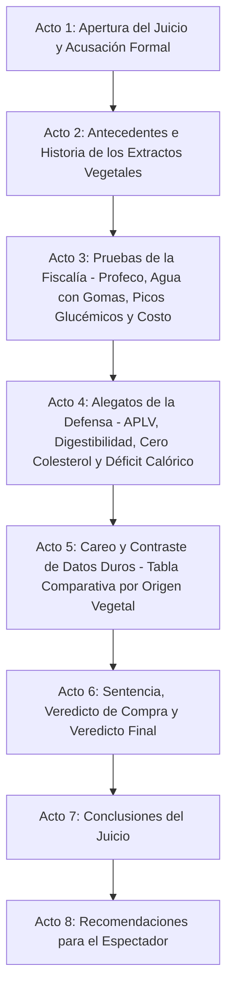

# Guion: "Bebidas Vegetales: ¿Salud líquida o agua cara con gomas?"

**Canal de YouTube:** `@JuicioAlimentoApetecible`  
**Serie / Formato:** Juicio Alimento Apetecible  
**Género:** Drama judicial divulgativo / Ciencia de los alimentos / Debate nutricional  
**Duración estimada:** 18:00 – 22:00 minutos  

---

## 1. Resumen del Video

En este episodio de **"Juicio Alimento Apetecible"**, Beto y Beti sientan en el banquillo de los acusados a uno de los fenómenos comerciales y gastronómicos más exitosos y publicitados de la última década: **Las Bebidas Vegetales** (erróneamente llamadas "leches" de almendra, soya, avena, coco y arroz).

Beto, en su papel de fiscal e ingeniero bioquímico, lidera una acusación técnica e implacable basada en el marco normativo de la **NOM-051-SCFI/SSA1-2010**, la **NOM-155-SCFI-2012** y los **Estudios de Calidad del Laboratorio Nacional de Protección al Consumidor de la Profeco (Revista del Consumidor de Mayo 2019, Mayo 2024 y Julio 2024)**. Beto desmantela el gigantesco espejismo de marketing que rodea a estos productos:
1. **La ilusión del ingrediente**: La mayoría de las bebidas comerciales de almendra contienen únicamente entre un **1.5% y 2.5% de almendras reales** (el equivalente a 3 o 4 almendras trituradas por litro); el restante 97% es agua, aceites vegetales añadidos (girasol/canola para emular cremosidad), espesantes sintéticos y emulsionantes (goma gellan, goma guar, fosfato dipotásico).
2. **Pobreza proteica crítica**: Salvo la soya (que aporta 6 a 8 g de proteína por vaso), las bebidas de almendra, arroz y coco aportan una cantidad insignificante de proteína (0.4 g a 1.2 g por vaso de 250 ml), careciendo del perfil de aminoácidos esenciales y del valor biológico (PDCAAS) de la leche tradicional.
3. **El caballo de Troya de los azúcares simples**: Las versiones "originales", "vainilla" o con sabor pueden contener hasta 12-15 gramos de azúcares añadidos por vaso; y en las bebidas de avena y arroz, la hidrólisis enzimática industrial descompone los almidones complejos en maltosa y glucosa de altísimo índice glucémico, provocando picos de glucosa e insulina en sangre.
4. **Sobreprecio exorbitante**: El consumidor paga entre $45.00 y $75.00 MXN por litro (un sobreprecio de más del 200% frente a la leche convencional) por una emulsión acuosa ultraprocesada.
5. **Riesgos de desnutrición pediátrica**: La peligrosa sustitución de la leche materna o de fórmula por bebidas vegetales en infantes y niños pequeños, lo cual ha generado casos clínicos documentados de desnutrición proteico-calórica (*Kwashiorkor*), hipocalcemia y deficiencias severas de vitamina B12 y D.

Por su parte, Beti encabeza una sólida, empática y realista defensa del consumidor contemporáneo:
1. **Salvavidas médico e inmunológico**: Representan la única alternativa segura para personas diagnosticadas con **Alergia a la Proteína de la Leche de Vaca (APLV)** (reacción inmune grave mediada por IgE a la caseína o betalactoglobulina), personas con galactosemia o con intolerancia severa a la lactosa (que afecta a más del 65% de la población adulta en México y Latinoamérica).
2. **Perfil cardiovascular y digestivo**: En sus versiones *Unsweetened* (sin azúcar añadido), aportan cero colesterol, cero grasas trans, casi nula grasa saturada (en almendra y soya) y un volumen calórico mínimo (30 a 40 kcal por vaso de almendra), convirtiéndose en un aliado estratégico para personas en planes de restricción calórica, pérdida de peso o control de lípidos en sangre.
3. **Ética, sostenibilidad y digestibilidad**: Permite a consumidores veganos, vegetarianos y ambientalmente conscientes acceder a preparaciones culinarias tradicionales (café, licuados, repostería) sin recurrir a la explotación animal y con una menor huella hídrica y de carbono global en el caso de la soya y la avena.
4. **Seguridad microbiológica e inocuidad**: Procesadas bajo tratamiento UHT y envasado aséptico multicapa, lo que garantiza esterilidad comercial y una vida útil prolongada en alacena sin requerir refrigeración previa ni conservadores químicos peligrosos.

El juicio culmina con un careo frontal mediante tablas comparativas rigurosas (Soya vs. Almendra vs. Avena vs. Coco vs. Arroz vs. Leche de Vaca Descremada), el interrogatorio al envase personificado en el banquillo, un veredicto de compra oficial basado en los semáforos de Profeco y las 4 reglas de oro para comprar y consumir bebidas vegetales sin caer en fraudes publicitarios.

---

## 2. Mapa Visual del Resumen Estructurado en Actos

* **Acto 1: Apertura del Juicio y Acusación Formal (00:00 – 02:20)**  
  Planteamiento del litigio. Beto presenta los cargos: publicidad engañosa ("leches falsas"), pobreza proteica alarmante, adición oculta de aceites vegetales, espesantes sintéticos y azúcares simples, sumado a un sobreprecio del 200%. Beti asume la defensa destacando su papel insustituible para personas con alergias lácteas (APLV), intolerancia severa, dietas basadas en plantas y control calórico.
* **Acto 2: Antecedentes e Historia (02:20 – 05:10)**  
  El viaje histórico: Desde la tradicional bebida de soya en la dinastía Han en China y la horchata medieval de almendras y chufas en el Mediterráneo, hasta el *boom* industrial moderno del siglo XXI impulsado por el marketing ecológico, Silicon Valley y el envasado aséptico Tetra Pak.
* **Acto 3: Pruebas de la Fiscalía (05:10 – 09:40)**  
  Radiografía científica y forense de los Estudios de Calidad de Profeco (2019 / 2024). Marcas analizadas (*Silk*, *Ades*, *Nature's Heart*, *Calahua*, *Blue Diamond*, *Gud*). El desglose real: 97% agua, 2% almendra, aceites añadidos, gomas espesantes (gellan/guar), picos de índice glucémico por maltosa en la avena y el peligro mortal de desnutrición infantil por sustitución inadecuada.
* **Acto 4: Alegatos de la Defensa (09:40 – 14:00)**  
  Beti defiende el valor terapéutico y funcional: alivio para pacientes con Alergia a la Proteína de la Leche de Vaca (APLV), ausencia de lactosa y caseína inflamatoria, cero colesterol dietético, conveniencia de 35 kcal por vaso en déficit calórico y la inocuidad del proceso UHT aséptico. El Cartón de Bebida Vegetal rinde testimonio en el estrado.
* **Acto 5: Careo y Contraste de Datos Duros (14:00 – 17:40)**  
  Tablas comparativas científicas: Soya vs. Almendra vs. Avena vs. Coco vs. Arroz vs. Leche de Vaca. Análisis de la biodisponibilidad del calcio añadido (carbonato vs. fosfato tricálcico y sedimentación) y el mito de los fitoestrógenos e isoflavonas de la soya.
* **Acto 6: Sentencia, Veredicto de Compra y Veredicto Final (17:40 – 19:50)**  
  Veredicto judicial: Culpable de fraude de denominación ("No es leche") y de venta de agua a precio de oro con azúcares añadidos; pero absuelta como alternativa terapéutica y aliada baja en calorías si se elige la versión correcta. Semáforo de compra de marcas evaluadas por Profeco.
* **Acto 7: Conclusiones del Juicio (19:50 – 21:00)**  
  Resumen ejecutivo de los hechos probados. Infografía de balance de macronutrientes y gráfico de sentencia.
* **Acto 8: Recomendaciones para el Espectador (21:00 – 22:15)**  
  Las 4 reglas de oro del consumidor inteligente para elegir bebidas vegetales en el supermercado sin ser engañado por la mercadotecnia.

---

## 3. Escaleta, Mediante una Tabla Estructurada en Actos / Escenas

| Acto | Escena | Nombre / Descripción | Duración Estimada |
| :--- | :--- | :--- | :--- |
| **Acto 1** | Escena 1 | Gancho Visual e Introducción: El vertido espumoso, la almendra solitaria y el golpe de mazo judicial | 00:00 – 00:45 |
| | Escena 2 | Declaración inicial y lectura formal de cargos de la Fiscalía (Beto) | 00:45 – 01:35 |
| | Escena 3 | Intervención inicial de la Defensa (Beti) y entrada del Envase Acusado al estrado | 01:35 – 02:20 |
| **Acto 2** | Escena 4 | Origen histórico: De la bebida de soya milenaria en China a la horchata europea y el *boom* del marketing *plant-based* | 02:20 – 03:45 |
| | Escena 5 | La ciencia de la emulsión vegetal: Cómo se convierte un puñado de semillas en líquido blanco opaco | 03:45 – 05:10 |
| **Acto 3** | Escena 6 | Radiografía del Estudio Profeco: El gran engaño del 2% de almendra y las marcas reprobadas | 05:10 – 06:40 |
| | Escena 7 | Lectura forense de etiquetas: NOM-051, aceites vegetales añadidos, gomas espesantes y azúcares ocultos | 06:40 – 08:10 |
| | Escena 8 | La bomba metabólica: Picos glucémicos en avena/arroz, pobreza proteica y riesgo de desnutrición infantil | 08:10 – 09:40 |
| **Acto 4** | Escena 9 | El salvavidas médico: Alergia a la proteína de leche de vaca (APLV), cero lactosa y digestión ligera | 09:40 – 11:20 |
| | Escena 10 | Aliado del déficit calórico: 35 kcal por vaso, cero colesterol y seguridad microbiológica UHT | 11:20 – 12:45 |
| | Escena 11 | Testimonio del alimento acusado (El Cartón de Bebida de Almendra y Soya en el banquillo) | 12:45 – 14:00 |
| **Acto 5** | Escena 12 | Tabla comparativa frontal: Soya vs. Almendra vs. Avena vs. Coco vs. Arroz vs. Leche de Vaca | 14:00 – 15:50 |
| | Escena 13 | Desmitificación científica: ¿Fitoestrógenos en soya? ¿Sedimentación del calcio añadido? | 15:50 – 17:40 |
| **Acto 6** | Escena 14 | Sentencia judicial y veredicto de compra (Marcas recomendadas vs. marcas reprobadas por Profeco) | 17:40 – 19:50 |
| **Acto 7** | Escena 15 | Resumen de los hechos probados y gráficos de la sentencia | 19:50 – 21:00 |
| **Acto 8** | Escena 16 | Alertas de salud, beneficios y las 4 reglas de oro para comprar y consumir bebidas vegetales con criterio | 21:00 – 22:15 |

---

## 4. Ficha Técnica de Producción

* **Acusador (Fiscalía):**  
  **BETO** (Ingeniero bioquímico, especialista en nutrición y tecnología de alimentos. Tono científico, didáctico, analítico, objetivo y respetuoso. Viste traje formal azul marino, corbata sobria, bata de laboratorio accesible en el respaldo y manipula tubos de ensayo, probetas de sedimentación de calcio, refractómetros y expedientes de Profeco).
* **Defensora (Bancada de la Defensa):**  
  **BETI** (Joven profesionista trabajadora, compradora informada y defensora de la alimentación práctica y saludable. Tono empático, vivaz, risueño, pragmático y agudo. Viste atuendo sastre casual moderno en verde oliva y blanco marfil, con una carpeta de alternativas alimentarias, un vaso de café con bebida vegetal espumada y muestras de semillas de soya y almendras).
* **El Acusado en el Estrado:**  
  **EL ENVASE DE BEBIDA VEGETAL** (Personificado / Cartón Tetra Pak moderno estilo minimalista con hojas verdes impresas, cartel de "100% Plant-Based / Sin Lactosa" y una pequeña corbata en la boquilla, ubicado sobre el banquillo de los testigos bajo foco cenital).
* **Ambientación:**  
  Sala de juzgado judicial moderna y elegante con paneles de madera de nogal, pantallas táctiles holográficas para visualización molecular (cadenas de maltosa, micelas de proteína de soya vs. caseína, suspensiones coloidales), estrado de testigos y una mesa forense con probetas donde se separan 4 almendras solitarias en 1 litro de agua frente a jarras de leche entera, bebida de soya, avena y arroz.
* **Estilo Audiovisual:**  
  Híbrido entre drama procesal judicial (*Law & Order* / *Better Call Saul*) y divulgación científica hiperestilizada (*Explained* / *Kurzgesagt*), con tomas macro gastronómicas a 60 fps en cámara lenta de la molienda de semillas y vertido cremoso, transiciones en látigo al golpe de mazo, animaciones 3D moleculares y gráficos nítidos de análisis de laboratorio.
* **Banda Sonora y Efectos:**  
  Golpes secos de mazo judicial de roble con reverberación profunda (*¡CLACK-BOOM!*), notas pulsantes de bajo acústico y sintetizador tenso para los argumentos forenses de Beto, acordes de piano rítmico y cuerdas acústicas ligeras para las intervenciones de Beti, y efectos de sonido foley realistas (trituración de almendras, burbujeo al vaporizar con lanceta de espresso, chasquido de tapón de rosca abriéndose, goteo de suero en probeta).
* **Indicaciones de Edición:**  
  Ritmo dinámico sin tiempos muertos. Inserción de rótulos inferiores (*lower-thirds*) para citar normas oficiales (NOM-051-SCFI/SSA1-2010, NOM-155-SCFI-2012) y los sellos negros de advertencia (EXCESO DE AZÚCARES, EXCESO DE CALORÍAS) cuando se analicen las marcas comerciales saborizadas.

---

## 5. Convención del Guion Técnico

* **[PLANO / VISUAL]:**  
  * `PG`: Plano General (vista panorámica de la sala judicial, fiscalía, estrado y defensa).
  * `PM`: Plano Medio (personaje de cintura hacia arriba).
  * `PP`: Primer Plano (rostro del personaje, gestos de convicción, duda o sorpresa).
  * `PD`: Primer Detalle (macro sobre la gota blanca cayendo, lectura de ingredientes en letra diminuta, sedimentación de polvo de calcio, golpe de mazo).
* **[CÁMARA / MOVIMIENTO DE CÁMARA]:** Slider lateral, Dolly frontal (travelling in/out), Paneo (pan horizontal), Tilt up/down vertical, Grúa cenital.
* **[ILUMINACIÓN / FILTROS]:** Luz fría judicial (5600K) en momentos de acusación técnica e inspección de sellos; Luz cálida matutina (3200K) en planos de café y desayuno saludable; Foco cenital directo sobre el acusado.
* **[AUDIO / SFX / MÚSICA]:** Sonido foley, música procesal dramática, golpes de mazo (*BOOM*), timbre judicial, suspenso con cuerdas graves y percusiones de reloj.
* **[TEXTO EN PANTALLA / GRÁFICOS / ANIMACIONES]:** Infografías 2D/3D con desglose porcentual de ingredientes (97% agua vs. 2% almendra), curvas de glucosa en sangre (avena vs. soya vs. leche de vaca), tablas comparativas de Profeco y cálculo del costo por gramo de proteína.

---

## 6. Guion Técnico Profesional Muy Detallado

### ACTO 1: APERTURA DEL JUICIO Y ACUSACIÓN FORMAL (00:00 – 02:20)

#### Escena 1 (00:00 – 00:45) — Gancho Visual e Introducción
* **Plano / Visual:** [PD] a 60 fps: Una prensa hidráulica aplasta cuatro almendras sobre un cristal oscuro. Corte inmediato a una cascada blanca espumosa cayendo en un vaso de vidrio que parece leche idéntica a la de vaca. Corte a una etiqueta minimalista con hojas verdes y letras doradas que dice "Almond Milk - 100% Natural". Corte abrupto a una centrifugadora de laboratorio donde el líquido blanco se separa en agua turbia transparente, una mota diminuta de pulpa y una masa viscosa de gomas transparentes.
* **Cámara / Movimiento de cámara:** Dolly in vertiginoso sobre el vaso espumoso; transición en látigo (whip-pan) hacia el mazo judicial de roble sobre el estrado del tribunal.
* **Iluminación / Filtros:** Luz cálida de comercial publicitario (3200K) que vira instantáneamente a luz blanca fría de quirófano judicial (5600K).
* **Audio / SFX / Música:** Sonido foley de triturado crujiente (*CRUNCH*), seguido de líquido sedoso (*swish-glug*). De golpe, impacto seco de mazo judicial con eco retumbante (*¡CLACK-BOOM!*). Entra tema principal de drama procesal judicial con bajo pulsante y cellos tensos.
* **Texto en Pantalla / Gráficos / Animaciones:** Rótulo animado en tipografía blanca y verde esmeralda: *"CASO Nº 64: BEBIDAS VEGETALES: ¿SALUD LÍQUIDA O AGUA CARA CON GOMAS?"*.

#### Escena 2 (00:45 – 01:35) — Declaración Inicial y Lectura de Cargos (Fiscalía)
* **Plano / Visual:** [PM] Beto de pie en la mesa de la Fiscalía. Viste traje azul marino impecable. Abre un expediente oficial con el sello del Laboratorio Nacional de Protección al Consumidor (Profeco) y coloca en la mesa un matraz de 1 litro de agua y exactamente 4 almendras enteras a su lado.
* **Cámara / Movimiento de cámara:** Slider lateral lento de izquierda a derecha, terminando en [PP] de Beto con mirada firme, científica y pedagógica.
* **Iluminación / Filtros:** Luz fría judicial directa (5600K) con contraluz azul cobalto de fondo.
* **Audio / SFX / Música:** Pulso continuo de sintetizador rítmico (*tic-toc-tic-toc*) con notas graves de chelo. Voz de Beto clara, autoritaria, segura y respetuosa.
* **Texto en Pantalla / Gráficos / Animaciones:** Lista animada de cargos criminales alimentarios:  
  * 1. Fraude comercial de denominación ("No es leche").  
  * 2. Ilusión del ingrediente: 97% agua y solo 2% fruto seco.  
  * 3. Pobreza proteica crítica (menos de 1 g por vaso).  
  * 4. Picos glucémicos por azúcares y maltosa oculta.  
  * 5. Sobreprecio injustificado del 200% al 300%.

#### Escena 3 (01:35 – 02:20) — Intervención Inicial de la Defensa (Beti)
* **Plano / Visual:** [PM] Beti en la mesa de la Defensa. Sonríe con calidez y seguridad; sostiene una taza de café humeante con espuma vegetal perfecta y abre su carpeta de casos médicos y nutrición cotidiana. [PG] de la sala mostrando al Cartón de Bebida Vegetal en el banquillo con cartel de "Inocente y Sin Lactosa".
* **Cámara / Movimiento de cámara:** Travelling lateral suave hacia Beti; corte a [PP] del envase acusado parpadeando tímido bajo el foco.
* **Iluminación / Filtros:** Luz cálida luminosa y acogedora sobre la bancada de Beti.
* **Audio / SFX / Música:** Acorde esperanzador de piano acústico que baja a volumen de fondo para dar paso a la voz enérgica, empática y convincente de Beti.
* **Texto en Pantalla / Gráficos / Animaciones:** Rótulo flotante de la Defensa: *"DEFENSA: Salvavidas para APLV + Cero Lactosa + Cero Colesterol + Aliado en Déficit Calórico"*.

---

### ACTO 2: ANTECEDENTES E HISTORIA (02:20 – 05:10)

#### Escena 4 (02:20 – 03:45) — Origen Histórico: De la Soya en la Dinastía Han a Silicon Valley
* **Plano / Visual:** [PG] Animación gráfica estilo pergamino antiguo: China, año 200 a.C. Campesinos de la dinastía Han moliendo grano de soya en molinos de piedra para crear el caldo *doujiang*. Transición a la España e Italia medieval del siglo XIII: preparación de "leche de almendras" y horchatas para los días de abstinencia de carne y lácteos durante la Cuaresma católica. Transición vertiginosa a un supermercado ultramoderno en 2015 con estantes repletos de envases de cartón minimalistas.
* **Cámara / Movimiento de cámara:** Panorámica digital sobre el mapa histórico con zoom suave hacia un envase moderno de Tetra Pak.
* **Iluminación / Filtros:** Tonalidad sepia oriental y medieval que transiciona a colores vivos y brillantes de retail contemporáneo.
* **Audio / SFX / Música:** Cuerdas acústicas e instrumentos tradicionales chinos (Guzheng) que evolucionan hacia música electrónica moderna y comercial. SFX de molienda de piedra, seguido del pitido de caja registradora (*ca-ching*).
* **Texto en Pantalla / Gráficos / Animaciones:** Línea de tiempo histórica:  
  * *164 a.C.*: Invención del *doujiang* (extracto acuoso de soya) en China.  
  * *Siglo XIII*: Leche de almendras como alimento de Cuaresma en Europa.  
  * *Años 2000*: Explosión global de bebidas de almendra, avena y coco como símbolo de estatus *fitness*.

#### Escena 5 (03:45 – 05:10) — La Ciencia de la Emulsión Vegetal
* **Plano / Visual:** [PD] Animación 3D fotorrealista del proceso físico-químico industrial: Molienda húmeda de semillas $\rightarrow$ extracción acuosa $\rightarrow$ separación de fibra insoluble por decantación centrífuga $\rightarrow$ adición de aceite vegetal y gomas estabilizantes (gellan/guar) $\rightarrow$ homogenización a alta presión (microgotas dispersas) $\rightarrow$ tratamiento térmico UHT.
* **Cámara / Movimiento de cámara:** Vuelo de cámara 3D microscópico atravesando una microgota de aceite suspendida y retenida por una red de polímeros de goma gellan en agua.
* **Iluminación / Filtros:** Fondo azul índigo oscuro con cadenas moleculares y gotas iluminadas en verde fosforescente y blanco brillante.
* **Audio / SFX / Música:** Música electrónica analítica y elegante. SFX de centrifugado, presión hidráulica y dispersión molecular.
* **Texto en Pantalla / Gráficos / Animaciones:** Desglose del proceso industrial:  
  * 1. Extracción acuosa (maceración + molienda).  
  * 2. Filtración de bagazo (se retira la mayor parte de la fibra nativa).  
  * 3. Emulsión asistida (aceite + gomas para evitar separación de fases).  
  * 4. Homogenización y esterilización UHT (140 °C por 3 segundos).

---

### ACTO 3: PRUEBAS DE LA FISCALÍA (05:10 – 09:40)

#### Escena 6 (05:10 – 06:40) — Radiografía del Estudio Profeco: El Espejismo del 2%
* **Plano / Visual:** [PM] Beto frente a una pantalla táctil gigante proyectando las portadas y tablas del Estudio de Calidad de la *Revista del Consumidor* (Mayo 2019 y Mayo/Julio 2024). Coloca sobre el estrado envases de marcas líderes (*Silk*, *Ades*, *Nature's Heart*, *Calahua*, *Blue Diamond Almond Breeze*, *Gud*).
* **Cámara / Movimiento de cámara:** Dolly in hacia los datos duros de la pantalla; corte a [PD] de una probeta graduada donde Beto vierte 975 ml de agua pura y echa solo 4 almendras trituradas.
* **Iluminación / Filtros:** Luz blanca analítica (6000K). Las marcas con irregularidades reciben un recuadro rojo intermitente.
* **Audio / SFX / Música:** Sonido de pulsos de escáner digital y acordes disonantes de tensión.
* **Texto en Pantalla / Gráficos / Animaciones:** Hallazgos del Laboratorio Profeco:  
  * Bebidas de almendra comerciales: Contienen entre **1.5% y 2.5%** de almendra real.  
  * Bebidas de coco: Menos del **8%** de extracto de coco.  
  * Bebidas de arroz: Menos del **10%** de arroz.  
  * Marcas que declaraban leyendas engañosas o no comprobadas fueron sancionadas.

#### Escena 7 (06:40 – 08:10) — Lectura Forense de Etiquetas: NOM-051, Aceites y Gomas
* **Plano / Visual:** [PP] Beto con una lupa de gran aumento examinando la lista de ingredientes al reverso de un cartón de bebida de almendra "Original". Muestra en un vidrio de reloj una sustancia gelatinosa transparente (goma gellan) y una cucharada de aceite de girasol refinado.
* **Cámara / Movimiento de cámara:** Slider horizontal lento comparando la lista de ingredientes limpia de la leche pura (1 solo ingrediente: leche) vs. la lista de 12 ingredientes de la bebida vegetal.
* **Iluminación / Filtros:** Luz cenital fría sobre las muestras de aditivos químicos.
* **Audio / SFX / Música:** Sonido de lupa rechinando sobre cartón, seguido de un golpe grave de percusión judicial.
* **Texto en Pantalla / Gráficos / Animaciones:** Lista forense de ingredientes típicos:  
  * Agua tratada (97%).  
  * Almendra molida (2%).  
  * Carbonato de calcio / Fosfato tricálcico.  
  * Aceite vegetal de girasol / canola (emulsionante de textura).  
  * Goma gellan, goma guar, goma xantana (espesantes).  
  * Sal yodada, saborizantes artificiales, vitamina E, A, D2, B12.

#### Escena 8 (08:10 – 09:40) — La Bomba Metabólica: Picos de Maltosa y Desnutrición Infantil
* **Plano / Visual:** [PM] Beto señala un gráfico interactivo con curvas de glucemia posprandial. Compara la curva plana de la leche entera/soya frente al pico abrupto de la bebida de avena y arroz. Corte a fotografías médicas (recreadas) y citas de la Academia Americana de Pediatría (AAP) alertando sobre desnutrición en lactantes alimentados con bebidas vegetales.
* **Cámara / Movimiento de cámara:** Paneo rápido hacia la animación del páncreas secretando insulina en exceso; zoom in a la cita médica de advertencia pediátrica.
* **Iluminación / Filtros:** Luz lateral dramática con sombras marcadas.
* **Audio / SFX / Música:** Sonido de latido cardíaco acelerado (*bum-bum-bum*) y acorde sombrío de advertencia.
* **Texto en Pantalla / Gráficos / Animaciones:** Alerta Médica y Metabólica:  
  * *Bebida de Avena/Arroz*: La hidrólisis enzimática genera **maltosa** (Índice Glucémico > 85), elevando la glucosa rápidamente.  
  * *Versiones Vainilla/Original*: Hasta 12 a 15 g de azúcares añadidos por vaso (3 terrones de sacarosa).  
  * *Alerta AAP / ESPGHAN*: Las bebidas vegetales **NO deben sustituir la leche materna ni fórmulas en menores de 2 años** (Riesgo de *Kwashiorkor*, raquitismo y daño neurológico por falta de B12).

---

### ACTO 4: ALEGATOS DE LA DEFENSA (09:40 – 14:00)

#### Escena 9 (09:40 – 11:20) — El Salvavidas Médico: APLV, Intolerancia Severa y Cero Lactosa
* **Plano / Visual:** [PM] Beti se levanta con energía y convicción. Muestra en pantalla el expediente de pacientes con Alergia a la Proteína de la Leche de Vaca (APLV), con síntomas de anafilaxia, eccema y sangrado digestivo. Muestra cómo las bebidas vegetales representan una bendición cotidiana para estas familias.
* **Cámara / Movimiento de cámara:** Slider dinámico acompañando a Beti mientras camina frente al jurado.
* **Iluminación / Filtros:** Luz cálida, limpia y reconfortante (4000K).
* **Audio / SFX / Música:** Música rítmica optimista y noble con piano, guitarra acústica y percusión ligera. Voz elocuente y empática de Beti.
* **Texto en Pantalla / Gráficos / Animaciones:** Beneficios médicos comprobados:  
  * *100% Libre de Lactosa*: Cero riesgo de fermentación bacteriana colónica, cólicos o distensión en personas con hipolactasia severa.  
  * *100% Libre de Caseína y Proteínas Lácteas*: Apta para personas con APLV.  
  * *Apta para dietas veganas y vegetarianas estrictas*.

#### Escena 10 (11:20 – 12:45) — Aliado del Déficit Calórico, Cero Colesterol e Inocuidad UHT
* **Plano / Visual:** [PM] Beti coloca dos vasos: uno de leche entera de vaca (150 kcal, 5 g de grasa saturada, 25 mg de colesterol) y uno de bebida de almendras *Unsweetened* (35 kcal, 0 g grasa saturada, 0 mg colesterol). Muestra la tecnología de envasado aséptico UHT que dura 9 meses en alacena sin requerir refrigeración ni conservadores químicos.
* **Cámara / Movimiento de cámara:** Travelling frontal hacia los dos vasos con gráfico flotante de calorías.
* **Iluminación / Filtros:** Luz brillante de alta definición.
* **Audio / SFX / Música:** Acordes ligeros y modernos. SFX de tapón de rosca abriéndose con clic de frescura.
* **Texto en Pantalla / Gráficos / Animaciones:** Comparación funcional para pérdida de grasa:  
  * Vaso de Almendra Sin Azúcar (250 ml): **35 kcal** vs. 150 kcal Leche Entera (Ahorro de 115 kcal por taza de café o licuado).  
  * Colesterol dietético: **0 mg**.  
  * Grasa saturada: < 0.2 g.  
  * Inocuidad total: Esterilización UHT a 140 °C.

#### Escena 11 (12:45 – 14:00) — Testimonio del Alimento Acusado en el Banquillo
* **Plano / Visual:** [PP] El Cartón de Bebida Vegetal en el banquillo de los testigos bajo foco cenital blanco. Beti se acerca cordialmente para interrogarlo.
* **Cámara / Movimiento de cámara:** Giro orbital suave de 180 grados alrededor del banquillo del acusado.
* **Iluminación / Filtros:** Foco cenital directo (spotlight) sobre el envase minimalista.
* **Audio / SFX / Música:** Voz en off personificada, joven, suave, ligeramente tímida pero firme, representando a la Bebida Vegetal. Fondo de violonchelo melódico.
* **Texto en Pantalla / Gráficos / Animaciones:** Testimonio en subtítulos dorados: *"Jamás pedí que me llamaran leche; fueron los publicistas. Yo nací para darte ligereza, acompañar tu café sin inflamarte el estómago y proteger a quienes no pueden tolerar los lácteos. Si eliges mi versión sin azúcar, soy tu mejor aliada"*.

---

### ACTO 5: CAREO Y CONTRASTE DE DATOS DUROS (14:00 – 17:40)

#### Escena 12 (14:00 – 15:50) — Tabla Comparativa Frontal: Soya vs. Almendra vs. Avena vs. Coco vs. Arroz vs. Leche
* **Plano / Visual:** [PG] Beto y Beti en el centro del juzgado frente a una mesa forense interactiva donde se despliegan seis vasos iluminados con sus respectivos análisis bromatológicos por porción de 250 ml.
* **Cámara / Movimiento de cámara:** Paneo continuo y fluido de izquierda a derecha deteniéndose en cada muestra.
* **Iluminación / Filtros:** Iluminación neutral de laboratorio de alta precisión.
* **Audio / SFX / Música:** Duelo musical procesal: bajo pulsante de la fiscalía alternando con el piano dinámico de la defensa.
* **Texto en Pantalla / Gráficos / Animaciones:** Tabla comparativa por vaso de 250 ml (Versiones sin azúcar añadido):  
  1. *Soya (Rey proteico vegetal)*: 80-100 kcal \| 7-8 g Prot \| 4 g Grasa \| 3 g Carb \| $32-$45 MXN/L  
  2. *Almendra (Rey calórico bajo)*: 30-40 kcal \| 1 g Prot \| 2.5 g Grasa \| 1-2 g Carb \| $45-$65 MXN/L  
  3. *Avena (Alto en carbohidrato)*: 110-130 kcal \| 2-3 g Prot \| 2.5 g Grasa \| 16-20 g Carb (Maltosa) \| $50-$70 MXN/L  
  4. *Coco (Rico en grasa saturada vegetal)*: 45-70 kcal \| 0.2 g Prot \| 4.5 g Grasa (TCM) \| 1-2 g Carb \| $48-$68 MXN/L  
  5. *Arroz (Pobreza proteica y alto IG)*: 120 kcal \| 0.4 g Prot \| 2 g Grasa \| 22 g Carb \| $45-$60 MXN/L  
  6. *Leche de Vaca Descremada*: 85 kcal \| 8.5 g Prot \| 0.5 g Grasa \| 12 g Carb (Lactosa) \| $26-$29 MXN/L

#### Escena 13 (15:50 – 17:40) — Desmitificación Científica: Isoflavonas de Soya y Sedimentación de Calcio
* **Plano / Visual:** [PM] Beto agita un envase de bebida vegetal transparente antes de servirlo para mostrar cómo el carbonato de calcio decanta y se queda pegado en el fondo si no se agita. Luego, Beti muestra metaanálisis clínicos sobre las isoflavonas de la soya demostrando que no alteran los niveles de testosterona en hombres ni causan cáncer de mama.
* **Cámara / Movimiento de cámara:** Slider horizontal de Beto agitando la probeta a Beti mostrando los estudios científicos en pantalla holográfica.
* **Iluminación / Filtros:** Luz blanca clínica balanceada.
* **Audio / SFX / Música:** SFX de líquido agitándose vigorosamente (*chac-chac-chac*). Música de resolución científica.
* **Texto en Pantalla / Gráficos / Animaciones:** Veredictos de la ciencia:  
  * *Sedimentación del Calcio*: El calcio añadido (carbonato/fosfato) es insoluble; **es obligatorio agitar vigorosamente el envase antes de cada uso**, de lo contrario se queda en el fondo.  
  * *Mito de la Soya*: Las isoflavonas son fitoestrógenos vegetales con afinidad selectiva por receptores beta; **no feminizan a los hombres ni alteran la testosterona** según revisiones sistemáticas de más de 40 ensayos clínicos.

---

### ACTO 6: SENTENCIA, VEREDICTO DE COMPRA Y VEREDICTO FINAL (17:40 – 19:50)

#### Escena 14 (17:40 – 19:50) — Sentencia Judicial y Semáforo de Compra Profeco
* **Plano / Visual:** [PG] Beto y Beti de pie frente al estrado del tribunal. El mazo judicial desciende en cámara lenta impactando la base de madera. En la pantalla gigante se despliega el Semáforo Oficial de Compra de Bebidas Vegetales.
* **Cámara / Movimiento de cámara:** Grúa cenital que desciende hacia el estrado; zoom in rápido al golpe de mazo y paneo a los gráficos de marcas.
* **Iluminación / Filtros:** Luz dramática cenital dorada y blanca.
* **Audio / SFX / Música:** Impacto ensordecedor de mazo (*¡CLACK-BOOM!*), seguido de fanfarria de cierre judicial con cuerdas y percusión triunfal.
* **Texto en Pantalla / Gráficos / Animaciones:** Semáforo de Compra Oficial (Basado en Profeco y Ciencia Nutricional):  
  * 🟢 **COMPRA RECOMENDADA (Luz Verde)**: Bebida de Soya *Unsweetened* (con >6 g de proteína y fortificada con calcio/B12) y Bebida de Almendra *Sin Azúcar* (para déficit calórico/café). Marcas con lista corta de ingredientes.  
  * 🟡 **COMPRA CONDICIONADA (Luz Amarilla)**: Bebida de Avena sin endulzar (excelente sabor para café/espuma, pero contabilizar sus carbohidratos simples); Bebida de Coco sin azúcar (para sabor tropical, pero alta en grasa saturada).  
  * 🔴 **EVITAR / NO RECOMENDADA (Luz Roja)**: Cualquier bebida vegetal "Original", "Vainilla" o "Chocolate" con azúcares añadidos; bebidas de arroz por alto índice glucémico y nula proteína; marcas sancionadas por Profeco por publicidad engañosa o faltante de contenido neto.

---

### ACTO 7: CONCLUSIONES DEL JUICIO (19:50 – 21:00)

#### Escena 15 (19:50 – 21:00) — Resumen de los Hechos Probados y Gráficos de Sentencia
* **Plano / Visual:** [PM] Plano compartido de Beto y Beti en el centro del juzgado. Ambos alternan la palabra con respeto y dinamismo, resumiendo los puntos cardinales del debate.
* **Cámara / Movimiento de cámara:** Slider frontal suave alternando entre Beto y Beti.
* **Iluminación / Filtros:** Luz neutra cálida de cierre de transmisión televisiva.
* **Audio / SFX / Música:** Tema musical de cierre, rítmico, sofisticado e inspirador.
* **Texto en Pantalla / Gráficos / Animaciones:** Infografía resumen:  
  * 1. No son leche (son alimentos líquidos de extracto vegetal).  
  * 2. No reemplazan la proteína animal a menos que sea SOYA.  
  * 3. En versión *Sin Azúcar*, son aliadas excepcionales contra la inflamación y en pérdida de grasa.  
  * 4. Nunca sustituir la nutrición láctea en menores de 2 años.

---

### ACTO 8: RECOMENDACIONES PARA EL ESPECTADOR (21:00 – 22:15)

#### Escena 16 (21:00 – 22:15) — Las 4 Reglas de Oro para el Consumidor Inteligente
* **Plano / Visual:** [PP] Beti y Beto despidiéndose a cámara. Se presentan en pantalla los 4 mandamientos de compra en el supermercado con gráficos animados de alta legibilidad.
* **Cámara / Movimiento de cámara:** Travelling out lento abriendo el plano hasta mostrar el set completo de grabación con el logo del canal.
* **Iluminación / Filtros:** Luz cálida y acogedora (3200K).
* **Audio / SFX / Música:** Música alegre de despedida, sonido de botón de suscripción (*click*) y campana de notificación (*ding*).
* **Texto en Pantalla / Gráficos / Animaciones:** Las 4 Reglas de Oro del Supermercado:  
  * 1. **Busca la palabra mágica "Sin Azúcar Añadido" / "Unsweetened"**.  
  * 2. **Si buscas músculo o saciedad, elige siempre SOYA**.  
  * 3. **Agita siempre el envase con fuerza antes de servir (para no dejar el calcio en el fondo)**.  
  * 4. **No pagues de más por agua: compara ingredientes y precios por litro**.  
  * Animación de llamada a la acción: *"Suscríbete a @JuicioAlimentoApetecible y comenta: ¿Qué bebida vegetal consumes tú?"*.

---

## 7. Guion Literario Profesional Muy Detallado

### ACTO 1: APERTURA DEL JUICIO Y ACUSACIÓN FORMAL (00:00 – 02:20)

#### Escena 1 — Gancho Visual e Introducción
**DURACIÓN ESTIMADA:** 00:00 – 00:45  
**ESCENARIO:** Sala de Audiencias Judicial - Mesa del Tribunal.  
**PERSONAJES:** BETO, BETI, EL CARTÓN DE BEBIDA VEGETAL (en el banquillo).  

**ACCIÓN:**  
La cámara abre con un plano macro del vertido sedoso, blanco y cremoso de un líquido que imita a la perfección a la leche de vaca. Un golpe rotundo de mazo judicial resuena en toda la sala. Beto y Beti se encuentran en sus respectivas bancadas. En el banquillo de los acusados reposa un estilizado envase de cartón Tetra Pak con hojas verdes impresas y la leyenda "100% Plant-Based".

**BETO**  
*(firme, voz sonora, mirando a la cámara con autoridad)*  
Se hace pasar por leche. Presume ser la cúspide de la vida saludable, el estatus ecológico y la pureza vegetal. Pero cuando sometemos su envase al rigor del laboratorio... descubrimos que el 97% de su contenido es simple agua purificada, mezclada con aceites vegetales, gomas industriales y apenas tres o cuatro almendras trituradas cobradas a precio de oro.

**BETI**  
*(interrumpiendo con una sonrisa cordial, tono vivaz y desafiante)*  
¡Un momento, señor Fiscal! Para millones de personas que sufren dolor abdominal por la lactosa, o para niños con alergias severas a la caseína, este líquido no es ningún fraude: ¡es el salvavidas que les permite volver a disfrutar de un café, un licuado o un desayuno sin terminar en el hospital!

**BETO**  
*(golpea suavemente el expediente contra el atril)*  
La ciencia no niega su utilidad terapéutica, Beti; lo que juzgamos hoy es el engaño publicitario de vender agua con espesantes como si fuera un sustituto nutricional de la leche. ¡Se abre la sesión en el Juicio a las Bebidas Vegetales!

---

#### Escena 2 — Declaración Inicial y Lectura de Cargos de la Fiscalía
**DURACIÓN ESTIMADA:** 00:45 – 01:35  
**ESCENARIO:** Sala de Audiencias - Estrado de la Fiscalía.  
**PERSONAJES:** BETO.  

**ACCIÓN:**  
Beto se ajusta la corbata, abre el expediente con sello oficial de la Profeco y coloca sobre la mesa un matraz con 1 litro de agua y 4 almendras solitarias.

**BETO**  
*(técnico, elocuente, ademanes precisos)*  
Honorables miembros del jurado, hoy comparece en este tribunal el producto con mayor inflación de marketing en la historia de los supermercados: las mal llamadas "leches" de origen vegetal. En estricto apego a la Norma Oficial Mexicana NOM-051 y a la NOM-155, la leche es, por definición biológica y legal, la secreción mamaria de hembras mamíferas. Llamar "leche" a un extracto de almendra, coco, avena o arroz es una violación directa al derecho a la información del consumidor.

**BETO**  
*(continúa con tono enérgico)*  
Formulamos cinco cargos criminales contra el acusado: primero, fraude de denominación. Segundo, la ilusión del ingrediente: las marcas comerciales contienen únicamente entre 1.5% y 2.5% de fruto seco. Tercero, una pobreza proteica alarmante que en almendra o coco no llega ni a un gramo por vaso. Cuarto, la adición de azúcares y maltosa oculta que provocan picos de glucemia. Y quinto, cobrar hasta 70 pesos por litro de agua con gomas.

---

#### Escena 3 — Intervención Inicial de la Defensa
**DURACIÓN ESTIMADA:** 01:35 – 02:20  
**ESCENARIO:** Sala de Audiencias - Estrado de la Defensa.  
**PERSONAJES:** BETI, EL CARTÓN DE BEBIDA VEGETAL.  

**ACCIÓN:**  
Beti se levanta con gracia, sostiene una carpeta de consumo familiar y muestra un vaso de bebida de almendra junto a su taza de café.

**BETI**  
*(empática, alegre, tono cercano al público)*  
Gracias, señor Fiscal. Pero no nos confundamos con tecnicismos legales de diccionario. Ningún consumidor sensato va al supermercado creyendo que ordeñaron una almendra o un grano de avena. La gente compra estas bebidas porque busca ligereza, porque tiene convicciones éticas contra la explotación animal, o porque el 70% de los adultos en nuestro país simplemente no toleramos la lactosa.

**BETI**  
*(acercándose al acusado en el estrado)*  
Este producto ofrece cero colesterol dietético, menos de 35 calorías por vaso en sus versiones sin endulzar, y una inocuidad absoluta gracias al envasado aséptico. Demostraremos que, cuando el consumidor elige la opción correcta, tiene en sus manos una herramienta formidable de salud.

---

### ACTO 2: ANTECEDENTES E HISTORIA (02:20 – 05:10)

#### Escena 4 — Origen Histórico: De la Dinastía Han a la Fiebre Plant-Based
**DURACIÓN ESTIMADA:** 02:20 – 03:45  
**ESCENARIO:** Sala de Audiencias - Pantalla Holográfica Histórica.  
**PERSONAJES:** BETO, BETI.  

**ACCIÓN:**  
La pantalla proyecta ilustraciones de la China imperial antigua y de monasterios medievales europeos.

**BETO**  
*(didáctico, señalando la pantalla)*  
Para entender a este acusado, debemos viajar al siglo segundo antes de Cristo en China. Durante la dinastía Han, se desarrolló el *doujiang*, un extracto acuoso obtenido al hervir y moler semillas de soya. No nació como sustituto de la leche de vaca, sino como una sopa reconfortante y la base para elaborar tofu.

**BETI**  
*(complementando con entusiasmo)*  
Y en el Mediterráneo medieval, durante los siglos trece y catorce, la leche de almendras se convirtió en el alimento estrella de reyes y campesinos durante la Cuaresma, cuando la Iglesia católica prohibía el consumo de lácteos de origen animal. ¡Tiene siglos de tradición culinaria!

**BETO**  
*(retomando con tono crítico)*  
Cierto, Beti; pero la fórmula artesanal tradicional era una pasta concentrada de almendras y agua. Lo que ocurrió en los años 2000 fue una metamorfosis industrial: las corporaciones descubrieron que podían licuar apenas 20 gramos de almendras en un litro de agua, agregarle emulsionantes químicos, ponerle un empaque verde con hojas y cobrarlo como un producto de lujo milagroso.

---

#### Escena 5 — La Ciencia de la Emulsión Vegetal
**DURACIÓN ESTIMADA:** 03:45 – 05:10  
**ESCENARIO:** Sala de Audiencias - Pantalla Molecular 3D.  
**PERSONAJES:** BETO.  

**ACCIÓN:**  
Beto activa la animación 3D de una gota de bebida de almendra en suspensión coloidal.

**BETO**  
*(riguroso, fascinado por la química)*  
Bioquímicamente, el agua y el aceite vegetal no se mezclan de forma espontánea. Para lograr esa textura blanca y homogénea que imita a la leche, la industria toma el extracto acuoso, retira el bagazo fibroso y añade agentes estabilizantes: principalmente **goma gellan**, **goma guar** o **goma algarrobo**, además de aceites refinados de girasol o canola para dar untuosidad.

**BETI**  
*(con curiosidad)*  
¿Y esas gomas son peligrosas para el consumidor, Beto?

**BETO**  
*(objetivo)*  
No son tóxicas; son polisacáridos aprobados por las autoridades sanitarias. Sin embargo, en personas con síndrome de intestino irritable o microbiota sensible, el exceso de gomas y carrageninas puede inducir flatulencia, inflamación y malestar digestivo. La magia blanca no es más que una red de polímeros que atrapa gotas microscópicas de agua y aceite.

---

### ACTO 3: PRUEBAS DE LA FISCALÍA (05:10 – 09:40)

#### Escena 6 — Radiografía del Estudio Profeco: El Espejismo del 2%
**DURACIÓN ESTIMADA:** 05:10 – 06:40  
**ESCENARIO:** Sala de Audiencias - Pantalla Gigante de Pruebas Forenses.  
**PERSONAJES:** BETO, BETI.  

**ACCIÓN:**  
Beto despliega los gráficos de los Estudios de Calidad del Laboratorio Nacional de Protección al Consumidor de la Profeco.

**BETO**  
*(severo, proyectando tablas analíticas)*  
Presento como prueba de cargo las evaluaciones oficiales de la Procuraduría Federal del Consumidor en su *Revista del Consumidor*. El Laboratorio analizó decenas de marcas comerciales de bebidas de almendra, soya, coco, avena y arroz. Y el veredicto fue contundente: en las bebidas de almendra, el contenido real del fruto seco oscila entre un raquítico **1.5% y 2.5%**.

**BETI**  
*(sorprendida, mirando la probeta)*  
Espera, Beto... ¿me estás diciendo que cuando compramos un litro de bebida de almendra, casi todo el cartón es agua pura?

**BETO**  
*(contundente)*  
Exactamente. Un litro de bebida de almendra comercial contiene en promedio entre 15 y 25 gramos de almendras. Eso equivale a entre **3 y 5 almendras en todo el cartón**. El resto es agua purificada, carbonato de calcio añadido, sal, aceite y gomas. Si compras una bolsa de 100 gramos de almendras en el mercado por 25 pesos, podrías preparar hasta cuatro litros de bebida casera infinitamente más concentrada.

---

#### Escena 7 — Lectura Forense de Etiquetas: NOM-051 y Azúcares Ocultos
**DURACIÓN ESTIMADA:** 06:40 – 08:10  
**ESCENARIO:** Sala de Audiencias - Mesa Forense.  
**PERSONAJES:** BETO, BETI.  

**ACCIÓN:**  
Beto coloca tres envases comerciales con sellos negros de advertencia (EXCESO DE AZÚCARES, EXCESO DE CALORÍAS).

**BETO**  
*(detallista, señalando los sellos de advertencia)*  
Observemos el engaño de las versiones saborizadas o etiquetadas como "Original" o "Vainilla". Como la almendra triturada en agua sabe insípida y acuosa, la industria le añade azúcar de caña o jarabes. Un solo vaso de 250 ml de bebida de soya o almendra saborizada puede contener entre **12 y 15 gramos de azúcares añadidos**.

**BETI**  
*(reflexiva)*  
¡Eso equivale a tres cucharaditas de azúcar por vaso! Es decir, la persona cree que está tomando una bebida *fitness* súper saludable, y en realidad se está bebiendo un refresco disfrazado de blanco.

**BETO**  
*(asiente)*  
Precisamente. Además, Profeco detectó marcas que incumplían con las leyendas precautorias de la NOM-051, declaraban contenidos de sodio erróneos o prometían propiedades antioxidantes no demostradas científicamente.

---

#### Escena 8 — La Bomba Metabólica: Picos Glucémicos y Desnutrición Infantil
**DURACIÓN ESTIMADA:** 08:10 – 09:40  
**ESCENARIO:** Sala de Audiencias - Pantalla de Dinámica Metabólica.  
**PERSONAJES:** BETO.  

**ACCIÓN:**  
Beto muestra una gráfica comparativa de glucosa en sangre tras consumir bebida de avena versus leche entera y soya.

**BETO**  
*(tono de profunda advertencia médica)*  
El problema no termina en los azúcares añadidos. Hablemos de las bebidas de **avena y arroz**. En su procesamiento industrial, los granos se someten a enzimas que rompen el almidón complejo para que el líquido sea fluido y dulce. ¿El resultado químico? Ese almidón se transforma en **maltosa**, un disacárido con un índice glucémico superior a 85, más alto incluso que el azúcar de mesa. Al beberlo, provoca un pico de glucosa e insulina violento en sangre.

**BETO**  
*(hace una pausa dramática, mirando fijamente a la cámara)*  
Y la acusación más grave de todas: la advertencia de la Academia Americana de Pediatría y la Sociedad Europea de Gastroenterología Pediátrica. Jamás se debe sustituir la leche materna o de fórmula por bebidas vegetales en niños menores de dos años. Se han registrado cuadros hospitalarios de desnutrición proteica severa tipo *Kwashiorkor*, hipocalcemia y retraso en el neurodesarrollo porque los padres creyeron erróneamente que una bebida de almendra o arroz alimentaba igual que la leche materna o entera.

---

### ACTO 4: ALEGATOS DE LA DEFENSA (09:40 – 14:00)

#### Escena 9 — El Salvavidas Médico: APLV y Cero Lactosa
**DURACIÓN ESTIMADA:** 09:40 – 11:20  
**ESCENARIO:** Sala de Audiencias - Estrado de la Defensa.  
**PERSONAJES:** BETI, BETO.  

**ACCIÓN:**  
Beti toma la palabra con aplomo y calidez, mostrando testimonios de madres y adultos con afecciones digestivas.

**BETI**  
*(elocuente, defensora apasionada)*  
Fiscal Beto, sus advertencias pediátricas son muy valiosas y deben difundirse con fuerza. Pero pongamos los hechos en perspectiva para el público adulto. En México, más del 65% de la población adulta padece algún grado de intolerancia a la lactosa porque perdimos la enzima lactasa en el intestino. Para esas personas, un vaso de leche de vaca significa cólicos, diarrea osmótica, distensión y gases insoportables.

**BETI**  
*(continúa con convicción)*  
Y aún más delicado: los pacientes con **Alergia a la Proteína de la Leche de Vaca (APLV)** no pueden consumir ni siquiera leche deslactosada, porque su sistema inmune reacciona contra la caseína y la betalactoglobulina provocando asma, dermatitis atópica y choque anafiláctico. Para ellos, las bebidas vegetales fortificadas son un sustituto funcional insustituible que les devuelve la normalidad en la mesa.

---

#### Escena 10 — Aliado en Déficit Calórico y Cero Colesterol
**DURACIÓN ESTIMADA:** 11:20 – 12:45  
**ESCENARIO:** Sala de Audiencias - Mesa de la Defensa.  
**PERSONAJES:** BETI.  

**ACCIÓN:**  
Beti coloca un vaso de bebida de almendras sin endulzar al lado de un plato de avena cocida y una taza de café espresso.

**BETI**  
*(práctica, tono motivador)*  
Hablemos de la vida cotidiana del adulto que busca cuidar su peso y su corazón. Un vaso de leche entera aporta 150 calorías, 8 gramos de grasa y 25 miligramos de colesterol. En cambio, un vaso de bebida de almendras **Sin Azúcar** aporta apenas **35 calorías**, cero colesterol y casi nada de grasa saturada.

**BETI**  
*(sonríe)*  
Si una persona sustituye su leche entera por bebida de almendras sin endulzar en sus dos cafés con leche diarios, ¡se ahorra más de 200 calorías al día! Eso representa una pérdida de casi un kilogramo de grasa corporal al mes solo con un cambio de hábito, sin renunciar al placer de un café cremoso.

---

#### Escena 11 — Testimonio del Alimento Acusado en el Banquillo
**DURACIÓN ESTIMADA:** 12:45 – 14:00  
**ESCENARIO:** Sala de Audiencias - Banquillo de los Testigos.  
**PERSONAJES:** EL CARTÓN DE BEBIDA VEGETAL (voz en off distorsionada, suave y juvenil), BETI.  

**ACCIÓN:**  
El foco cenital ilumina al Cartón de Bebida Vegetal. Beti se coloca a su lado.

**BETI**  
Diga su nombre y declare la verdad ante este jurado.

**EL CARTÓN DE BEBIDA VEGETAL**  
*(voz suave, pausada, tranquila)*  
Soy un alimento líquido de extracto vegetal. Nací en los campos de soya y en los huertos de almendros. Nunca busqué competir con las vacas; fueron las campañas publicitarias las que me vistieron con un traje que no era mío y me llamaron "leche". Mi vocación es acompañar tu café matutino con ligereza, ofrecer una alternativa ética a quienes protegen a los animales y cuidar los estómagos de quienes no pueden digerir los lácteos. Si me buscas sin azúcares añadidos y me agitas antes de servir, solo te daré bienestar.

---

### ACTO 5: CAREO Y CONTRASTE DE DATOS DUROS (14:00 – 17:40)

#### Escena 12 — Tabla Comparativa Frontal: Soya vs. Almendra vs. Avena vs. Coco vs. Arroz vs. Leche
**DURACIÓN ESTIMADA:** 14:00 – 15:50  
**ESCENARIO:** Sala de Audiencias - Mesa Central del Juzgado.  
**PERSONAJES:** BETO, BETI.  

**ACCIÓN:**  
Beto y Beti se paran frente a una pantalla horizontal gigante que despliega la matriz bromatológica completa.

**BETO**  
*(analítico, señalando cada fila)*  
Ha llegado el momento del careo definitivo. Analicemos qué aporta realmente cada variedad vegetal por porción de 250 ml en su versión sin azúcar:

**BETO**  
*(señala la muestra 1: SOYA)*  
**Bebida de Soya**: La reina proteica vegetal. Aporta entre **7 y 8 gramos de proteína de alto valor biológico**, 4 gramos de grasa saludable y unas 80 a 100 calorías. Es la **única** bebida vegetal comparable nutricionalmente con la leche de vaca.

**BETI**  
*(señala la muestra 2: ALMENDRA)*  
**Bebida de Almendra**: La campeona del déficit calórico. Solo **30 a 35 calorías**, 2.5 gramos de grasa monoinsaturada, pero apenas 1 gramo de proteína. Ideal para mezclar con café o licuados que ya incluyan proteína en polvo.

**BETO**  
*(señala la muestra 3: AVENA)*  
**Bebida de Avena**: Textura cremosa inigualable para espumar café barista, pero aporta **16 a 20 gramos de carbohidratos (maltosa)** y 120 calorías. Las personas con resistencia a la insulina o diabetes deben consumirla con mucha moderación.

**BETI**  
*(señala la muestra 4: COCO)*  
**Bebida de Coco**: Sabor tropical delicioso, 45 a 70 calorías, pero casi nada de proteína (0.2 g) y aporta triglicéridos de cadena media (grasa saturada vegetal).

**BETO**  
*(señala la muestra 5: ARROZ)*  
**Bebida de Arroz**: La más hipoalergénica, pero nutricionalmente la más deficiente: 22 gramos de carbohidratos simples de absorción rápida, casi cero proteína y alto índice glucémico.

---

#### Escena 13 — Desmitificación Científica: Isoflavonas y Sedimentación de Calcio
**DURACIÓN ESTIMADA:** 15:50 – 17:40  
**ESCENARIO:** Sala de Audiencias - Mesa Forense de Demostración.  
**PERSONAJES:** BETO, BETI.  

**ACCIÓN:**  
Beto toma una botella de bebida vegetal transparente sin agitar y apunta a una capa blanca y densa asentada en el fondo.

**BETO**  
*(demostrativo)*  
Atención a este detalle químico crucial que el 90% de los consumidores desconoce: las bebidas vegetales no contienen calcio natural en cantidades significativas; la industria les añade **carbonato de calcio** o **fosfato tricálcico**. Estas sales minerales son insolubles en agua y decantan por gravedad hacia el fondo del envase. Si no agitas el cartón con fuerza antes de servirte, te estás bebiendo agua sin calcio y dejando todo el mineral pegado en el fondo del cartón.

**BETI**  
*(toma un cartón y lo agita con vigor frente a la cámara)*  
¡Regla aprendida: agitar vigorosamente siempre antes de servir! Ahora bien, Beto, aclaremos el gran mito que asusta a muchos hombres: ¿la soya feminiza o altera la testosterona por sus isoflavonas?

**BETO**  
*(enfático, derribando el mito)*  
Falso mito totalmente desmentido por la ciencia. Las isoflavonas de la soya son fitoestrógenos vegetales que tienen una estructura molecular similar pero con una afinidad mil veces menor y selectiva por receptores celulares beta. Más de 40 metaanálisis y ensayos clínicos controlados han demostrado que el consumo moderado de soya **no reduce la testosterona, no aumenta los estrógenos en hombres ni causa ginecomastia**. Es un alimento seguro y protector cardiovascular.

---

### ACTO 6: SENTENCIA, VEREDICTO DE COMPRA Y VEREDICTO FINAL (17:40 – 19:50)

#### Escena 14 — Sentencia Judicial y Veredicto de Compra
**DURACIÓN ESTIMADA:** 17:40 – 19:50  
**ESCENARIO:** Sala de Audiencias - Estrado Judicial.  
**PERSONAJES:** BETO, BETI.  

**ACCIÓN:**  
Beto y Beti se colocan frente al mazo judicial. La iluminación se intensifica. Beto levanta el acta oficial de sentencia.

**BETO**  
*(solemne, con autoridad)*  
Habiendo evaluado las pruebas de laboratorio, los dictámenes de Profeco y las evidencias bioquímicas, este tribunal emite su veredicto formal sobre las Bebidas Vegetales:

**BETO**  
Se declara a las Bebidas Vegetales **CULPABLES** del delito de usurpación de nombre ("No son leche"), culpables de especulación de precios al cobrar 3 almendras a precio de oro, y culpables de inducir a picos glucémicos en sus versiones saborizadas con azúcar.

**BETI**  
*(con una sonrisa triunfal)*  
¡Pero se les declara **ABSUELTAS Y RECOMENDADAS** como sustituto culinario y terapéutico de primer orden para intolerantes a la lactosa, alérgicos a la caseína láctea, veganos y personas que buscan un déficit calórico ligero!

**BETO**  
*(presentando el semáforo de compra en la pantalla gigante)*  
Y nuestro **Veredicto Oficial de Compra**:  
* **SEMÁFORO VERDE**: Bebida de Soya *Unsweetened* (para nutrición proteica completa) y Bebida de Almendra *Sin Azúcar* (para café o pérdida de grasa).  
* **SEMÁFORO AMARILLO**: Bebida de Avena sin endulzar (excelente textura, pero cuida tus carbohidratos) y Bebida de Coco sin azúcar.  
* **SEMÁFORO ROJO (EVITAR)**: Bebidas de almendra, soya o avena sabor "Original", "Vainilla" o "Chocolate" con sellos de azúcares añadidos, y bebidas de arroz por su bajo aporte nutritivo.

---

### ACTO 7: CONCLUSIONES DEL JUICIO (19:50 – 21:00)

#### Escena 15 — Resumen de los Hechos Probados
**DURACIÓN ESTIMADA:** 19:50 – 21:00  
**ESCENARIO:** Sala de Audiencias - Plano Medio Compartido.  
**PERSONAJES:** BETO, BETI.  

**ACCIÓN:**  
Beto y Beti miran directamente a la audiencia, sintetizando los aprendizajes del caso.

**BETO**  
*(didáctico)*  
En conclusión: una bebida vegetal no es mejor ni peor que la leche de vaca; es un alimento completamente distinto. Si buscas proteína para construir músculo o nutrir a tu familia con poco presupuesto, la leche de vaca descremada o la bebida de soya son las ganadoras indiscutibles.

**BETI**  
*(empática)*  
Pero si tu prioridad es la ligereza estomacal, el respeto al bienestar animal o ahorrar calorías en tu café de todos los días, la bebida de almendra sin azúcar es una herramienta extraordinaria, siempre y cuando no pagues caprichos de marcas con azúcares añadidos.

---

### ACTO 8: RECOMENDACIONES PARA EL ESPECTADOR (21:00 – 22:15)

#### Escena 16 — Las 4 Reglas de Oro del Consumidor Inteligente
**DURACIÓN ESTIMADA:** 21:00 – 22:15  
**ESCENARIO:** Sala de Audiencias - Plano de Cierre y Despedida.  
**PERSONAJES:** BETI, BETO.  

**ACCIÓN:**  
Aparecen en pantalla gráficos dinámicos con los cuatro mandamientos de compra inteligente.

**BETI**  
Para que nunca más te engañen en el supermercado, anota las **4 Reglas de Oro**:  
**Primera**: Revisa que en el frente diga explícitamente **"Sin Azúcar Añadido"** o *"Unsweetened"*. Si tiene azúcar, es un postre líquido.  
**Segunda**: Si buscas saciedad y músculo, elige **SOYA** con más de 6 gramos de proteína por porción.

**BETO**  
**Tercera**: **¡Agita siempre el cartón con fuerza antes de servir!** El calcio fortificado se asienta en el fondo.  
**Cuarta**: Jamás reemplaces la leche materna o fórmulas en bebés y niños pequeños con bebidas vegetales.

**BETI**  
*(sonríe a cámara)*  
Si te sirvió este juicio, dale pulgar arriba, suscríbete a `@JuicioAlimentoApetecible` y cuéntanos en los comentarios: ¿Cuál es tu bebida vegetal favorita y cómo la utilizas?

**BETO**  
Nos vemos en el próximo juicio al alimento cotidiano. ¡Hasta la próxima!

---

## 8. Guion Profesional con la Mezcla Integrada del Guion Técnico y Guion Literario

### ACTO 1: APERTURA DEL JUICIO Y ACUSACIÓN FORMAL (00:00 – 02:20)

#### Escena 1 (00:00 – 00:45) — Gancho Visual e Introducción
* **[PLANO / VISUAL]:** [PD] a 60 fps: Una prensa hidráulica tritura cuatro almendras sobre un cristal oscuro. Corte inmediato a una cascada blanca espumosa cayendo en un vaso de vidrio que imita a la perfección a la leche de vaca. Corte a una etiqueta minimalista con hojas verdes y letras doradas que dice "Almond Milk - 100% Natural". Corte abrupto a una centrifugadora de laboratorio donde el líquido blanco se separa en agua turbia transparente, una mota diminuta de pulpa y una masa viscosa de gomas transparentes.
* **[CÁMARA / MOVIMIENTO]:** Dolly in vertiginoso sobre el vaso espumoso; transición en látigo (whip-pan) hacia el mazo judicial de roble sobre el estrado del tribunal.
* **[ILUMINACIÓN / FILTROS]:** Luz cálida de comercial publicitario (3200K) que vira instantáneamente a luz blanca fría de quirófano judicial (5600K).
* **[AUDIO / SFX / MÚSICA]:** Sonido foley de triturado crujiente (*CRUNCH*), seguido de líquido sedoso (*swish-glug*). De golpe, impacto seco de mazo judicial con eco retumbante (*¡CLACK-BOOM!*). Entra tema principal de drama procesal judicial con bajo pulsante y cellos tensos.
* **[TEXTO EN PANTALLA]:** Rótulo animado en tipografía blanca y verde esmeralda: *"CASO Nº 64: BEBIDAS VEGETALES: ¿SALUD LÍQUIDA O AGUA CARA CON GOMAS?"*.
* **[ACCIÓN]:** Beto y Beti se encuentran en sus respectivas bancadas. En el banquillo de los acusados reposa un estilizado envase de cartón Tetra Pak con hojas verdes impresas y la leyenda "100% Plant-Based".
* **DIÁLOGOS:**  
  **BETO:** *(firme, voz sonora, mirando a la cámara con autoridad)* Se hace pasar por leche. Presume ser la cúspide de la vida saludable, el estatus ecológico y la pureza vegetal. Pero cuando sometemos su envase al rigor del laboratorio... descubrimos que el 97% de su contenido es simple agua purificada, mezclada con aceites vegetales, gomas industriales y apenas tres o cuatro almendras trituradas cobradas a precio de oro.  
  **BETI:** *(interrumpiendo con una sonrisa cordial, tono vivaz y desafiante)* ¡Un momento, señor Fiscal! Para millones de personas que sufren dolor abdominal por la lactosa, o para niños con alergias severas a la caseína, este líquido no es ningún fraude: ¡es el salvavidas que les permite volver a disfrutar de un café, un licuado o un desayuno sin terminar en el hospital!  
  **BETO:** *(golpea suavemente el expediente contra el atril)* La ciencia no niega su utilidad terapéutica, Beti; lo que juzgamos hoy es el engaño publicitario de vender agua con espesantes como si fuera un sustituto nutricional de la leche. ¡Se abre la sesión en el Juicio a las Bebidas Vegetales!

#### Escena 2 (00:45 – 01:35) — Declaración Inicial y Lectura de Cargos de la Fiscalía
* **[PLANO / VISUAL]:** [PM] Beto de pie en la mesa de la Fiscalía. Viste traje azul marino impecable. Abre un expediente oficial con el sello del Laboratorio Nacional de Protección al Consumidor (Profeco) y coloca en la mesa un matraz de 1 litro de agua y exactamente 4 almendras enteras a su lado.
* **[CÁMARA / MOVIMIENTO]:** Slider lateral lento de izquierda a derecha, terminando en [PP] de Beto con mirada firme, científica y pedagógica.
* **[ILUMINACIÓN / FILTROS]:** Luz fría judicial directa (5600K) con contraluz azul cobalto de fondo.
* **[AUDIO / SFX / MÚSICA]:** Pulso continuo de sintetizador rítmico (*tic-toc-tic-toc*) con notas graves de chelo. Voz de Beto clara, autoritaria, segura y respetuosa.
* **[TEXTO EN PANTALLA]:** Lista animada de cargos: 1. Fraude de denominación ("No es leche") | 2. 97% agua y solo 2% fruto seco | 3. Pobreza proteica (<1 g/vaso) | 4. Picos glucémicos por azúcares y maltosa | 5. Sobreprecio del 200%.
* **[ACCIÓN]:** Beto se ajusta la corbata, abre el expediente de Profeco y coloca el matraz de agua con las cuatro almendras en el centro de la mesa.
* **DIÁLOGOS:**  
  **BETO:** *(técnico, elocuente, ademanes precisos)* Honorables miembros del jurado, hoy comparece en este tribunal el producto con mayor inflación de marketing en la historia de los supermercados: las mal llamadas "leches" de origen vegetal. En estricto apego a la Norma Oficial Mexicana NOM-051 y a la NOM-155, la leche es, por definición biológica y legal, la secreción mamaria de hembras mamíferas. Llamar "leche" a un extracto de almendra, coco, avena o arroz es una violación directa al derecho a la información del consumidor. Formulamos cinco cargos criminales contra el acusado: primero, fraude de denominación. Segundo, la ilusión del ingrediente: las marcas comerciales contienen únicamente entre 1.5% y 2.5% de fruto seco. Tercero, una pobreza proteica alarmante que en almendra o coco no llega ni a un gramo por vaso. Cuarto, la adición de azúcares y maltosa oculta que provocan picos de glucemia. Y quinto, cobrar hasta 70 pesos por litro de agua con gomas.

#### Escena 3 (01:35 – 02:20) — Intervención Inicial de la Defensa
* **[PLANO / VISUAL]:** [PM] Beti en la mesa de la Defensa. Sonríe con calidez y seguridad; sostiene una taza de café humeante con espuma vegetal perfecta y abre su carpeta de casos médicos y nutrición cotidiana. [PG] de la sala mostrando al Cartón de Bebida Vegetal en el banquillo con cartel de "Inocente y Sin Lactosa".
* **[CÁMARA / MOVIMIENTO]:** Travelling lateral suave hacia Beti; corte a [PP] del envase acusado parpadeando tímido bajo el foco cenital.
* **[ILUMINACIÓN / FILTROS]:** Luz cálida luminosa y acogedora sobre la bancada de Beti.
* **[AUDIO / SFX / MÚSICA]:** Acorde esperanzador de piano acústico que baja a volumen de fondo para dar paso a la voz enérgica, empática y convincente de Beti.
* **[TEXTO EN PANTALLA]:** Rótulo flotante: *"DEFENSA: Salvavidas para APLV + Cero Lactosa + Cero Colesterol + Aliado en Déficit Calórico"*.
* **[ACCIÓN]:** Beti se levanta con gracia, sostiene su carpeta y muestra el vaso con café espumado junto a la muestra vegetal.
* **DIÁLOGOS:**  
  **BETI:** *(empática, alegre, tono cercano al público)* Gracias, señor Fiscal. Pero no nos confundamos con tecnicismos legales de diccionario. Ningún consumidor sensato va al supermercado creyendo que ordeñaron una almendra o un grano de avena. La gente compra estas bebidas porque busca ligereza, porque tiene convicciones éticas contra la explotación animal, o porque el 70% de los adultos en nuestro país simplemente no toleramos la lactosa. *(acercándose al acusado)* Este producto ofrece cero colesterol dietético, menos de 35 calorías por vaso en sus versiones sin endulzar, y una inocuidad absoluta gracias al envasado aséptico. Demostraremos que, cuando el consumidor elige la opción correcta, tiene en sus manos una herramienta formidable de salud.

---

### ACTO 2: ANTECEDENTES E HISTORIA (02:20 – 05:10)

#### Escena 4 (02:20 – 03:45) — Origen Histórico: De la Dinastía Han al Boom Plant-Based
* **[PLANO / VISUAL]:** [PG] Animación gráfica estilo pergamino antiguo: China, año 200 a.C. Campesinos de la dinastía Han moliendo grano de soya en molinos de piedra para crear el caldo *doujiang*. Transición a la Europa medieval del siglo XIII: preparación de leche de almendras para la Cuaresma. Transición a un supermercado moderno con estantes repletos de Tetra Pak.
* **[CÁMARA / MOVIMIENTO]:** Panorámica digital sobre el mapa histórico con zoom suave hacia un envase moderno de Tetra Pak.
* **[ILUMINACIÓN / FILTROS]:** Tonalidad sepia oriental y medieval que transiciona a colores vivos y brillantes de retail contemporáneo.
* **[AUDIO / SFX / MÚSICA]:** Cuerdas tradicionales chinas (Guzheng) que evolucionan hacia música electrónica moderna. SFX de molienda de piedra y sonido de caja registradora (*ca-ching*).
* **[TEXTO EN PANTALLA]:** Línea de tiempo: 164 a.C. (Soya en China) $\rightarrow$ Siglo XIII (Leche de almendras en Cuaresma) $\rightarrow$ Años 2000 (Explosión global de mercado).
* **[ACCIÓN]:** Beto señala la pantalla interactiva y Beti complementa con datos de la cocina tradicional europea.
* **DIÁLOGOS:**  
  **BETO:** *(didáctico, señalando la pantalla)* Para entender a este acusado, debemos viajar al siglo segundo antes de Cristo en China. Durante la dinastía Han, se desarrolló el *doujiang*, un extracto acuoso obtenido al hervir y moler semillas de soya. No nació como sustituto de la leche de vaca, sino como una sopa reconfortante y la base para elaborar tofu.  
  **BETI:** *(complementando con entusiasmo)* Y en el Mediterráneo medieval, durante los siglos trece y catorce, la leche de almendras se convirtió en el alimento estrella de reyes y campesinos durante la Cuaresma, cuando la Iglesia católica prohibía el consumo de lácteos de origen animal. ¡Tiene siglos de tradición culinaria!  
  **BETO:** *(retomando con tono crítico)* Cierto, Beti; pero la fórmula artesanal tradicional era una pasta concentrada de almendras y agua. Lo que ocurrió en los años 2000 fue una metamorfosis industrial: las corporaciones descubrieron que podían licuar apenas 20 gramos de almendras en un litro de agua, agregarle emulsionantes químicos, ponerle un empaque verde con hojas y cobrarlo como un producto de lujo milagroso.

#### Escena 5 (03:45 – 05:10) — La Ciencia de la Emulsión Vegetal
* **[PLANO / VISUAL]:** [PD] Animación 3D fotorrealista del proceso físico-químico industrial: Molienda húmeda $\rightarrow$ extracción acuosa $\rightarrow$ decantación centrífuga de fibra $\rightarrow$ adición de aceite vegetal y gomas estabilizantes (gellan/guar) $\rightarrow$ homogenización a alta presión $\rightarrow$ esterilización UHT.
* **[CÁMARA / MOVIMIENTO]:** Vuelo de cámara 3D microscópico atravesando una microgota de aceite suspendida y retenida por una red de polímeros de goma gellan en agua.
* **[ILUMINACIÓN / FILTROS]:** Fondo azul índigo oscuro con cadenas moleculares y partículas iluminadas en verde y blanco brillante.
* **[AUDIO / SFX / MÚSICA]:** Música electrónica analítica. SFX de centrifugado, presión hidráulica y dispersión molecular.
* **[TEXTO EN PANTALLA]:** Pasos industriales: 1. Extracción acuosa | 2. Filtrado de bagazo | 3. Emulsión con aceites y gomas | 4. Homogenización y UHT a 140 °C.
* **[ACCIÓN]:** Beto explica la física coloidal en la pantalla táctil mientras Beti observa con genuino interés.
* **DIÁLOGOS:**  
  **BETO:** *(riguroso, fascinado por la química)* Bioquímicamente, el agua y el aceite vegetal no se mezclan de forma espontánea. Para lograr esa textura blanca y homogénea que imita a la leche, la industria toma el extracto acuoso, retira el bagazo fibroso y añade agentes estabilizantes: principalmente **goma gellan**, **goma guar** o **goma algarrobo**, además de aceites refinados de girasol o canola para dar untuosidad.  
  **BETI:** *(con curiosidad)* ¿Y esas gomas son peligrosas para el consumidor, Beto?  
  **BETO:** *(objetivo)* No son tóxicas; son polisacáridos aprobados por las autoridades sanitarias. Sin embargo, en personas con síndrome de intestino irritable o microbiota sensible, el exceso de gomas y carrageninas puede inducir flatulencia, inflamación y malestar digestivo. La magia blanca no es más que una red de polímeros que atrapa gotas microscópicas de agua y aceite.

---

### ACTO 3: PRUEBAS DE LA FISCALÍA (05:10 – 09:40)

#### Escena 6 (05:10 – 06:40) — Radiografía del Estudio Profeco: El Espejismo del 2%
* **[PLANO / VISUAL]:** [PM] Beto frente a una pantalla táctil gigante proyectando las portadas y tablas del Estudio de Calidad de la *Revista del Consumidor* (Mayo 2019 y Mayo/Julio 2024). Coloca sobre el estrado envases comerciales (*Silk*, *Ades*, *Nature's Heart*, *Calahua*, *Blue Diamond*, *Gud*).
* **[CÁMARA / MOVIMIENTO]:** Dolly in hacia los datos duros de la pantalla; corte a [PD] de una probeta donde Beto vierte 975 ml de agua y coloca 4 almendras trituradas.
* **[ILUMINACIÓN / FILTROS]:** Luz blanca analítica (6000K). Las marcas con irregularidades reciben un recuadro rojo intermitente.
* **[AUDIO / SFX / MÚSICA]:** Sonido de pulsos de escáner digital y acordes disonantes de tensión.
* **[TEXTO EN PANTALLA]:** Hallazgos Profeco: Almendra (1.5% a 2.5% de fruto) | Coco (<8% extracto) | Arroz (<10% arroz).
* **[ACCIÓN]:** Beto expone los datos del laboratorio con ademanes firmes mientras Beti examina la probeta con asombro.
* **DIÁLOGOS:**  
  **BETO:** *(severo, proyectando tablas analíticas)* Presento como prueba de cargo las evaluaciones oficiales de la Procuraduría Federal del Consumidor en su *Revista del Consumidor*. El Laboratorio analizó decenas de marcas comerciales de bebidas de almendra, soya, coco, avena y arroz. Y el veredicto fue contundente: en las bebidas de almendra, el contenido real del fruto seco oscila entre un raquítico **1.5% y 2.5%**.  
  **BETI:** *(sorprendida, mirando la probeta)* Espera, Beto... ¿me estás diciendo que cuando compramos un litro de bebida de almendra, casi todo el cartón es agua pura?  
  **BETO:** *(contundente)* Exactamente. Un litro de bebida de almendra comercial contiene en promedio entre 15 y 25 gramos de almendras. Eso equivale a entre **3 y 5 almendras en todo el cartón**. El resto es agua purificada, carbonato de calcio añadido, sal, aceite y gomas. Si compras una bolsa de 100 gramos de almendras en el mercado por 25 pesos, podrías preparar hasta cuatro litros de bebida casera infinitamente más concentrada.

#### Escena 7 (06:40 – 08:10) — Lectura Forense de Etiquetas: NOM-051 y Azúcares Ocultos
* **[PLANO / VISUAL]:** [PP] Beto con una lupa de gran aumento examinando la lista de ingredientes al reverso de un cartón de bebida vegetal sabor "Vainilla". Muestra en un vidrio de reloj goma gellan transparente y una cucharada de aceite de girasol refinado.
* **[CÁMARA / MOVIMIENTO]:** Slider horizontal comparando la lista de 1 solo ingrediente de la leche fresca vs. la lista de 12 aditivos de la bebida vegetal comercial.
* **[ILUMINACIÓN / FILTROS]:** Luz cenital fría sobre las muestras de aditivos.
* **[AUDIO / SFX / MÚSICA]:** Sonido foley de lupa sobre cartón y golpe grave de percusión judicial.
* **[TEXTO EN PANTALLA]:** Ingredientes típicos: Agua (97%), Almendra (2%), Gomas (gellan, guar), Aceite vegetal, Azúcar añadida (12-15 g/vaso).
* **[ACCIÓN]:** Beto señala los sellos de advertencia de la NOM-051 y Beti calcula los terrones de azúcar equivalentes.
* **DIÁLOGOS:**  
  **BETO:** *(detallista, señalando los sellos de advertencia)* Observemos el engaño de las versiones saborizadas o etiquetadas como "Original" o "Vainilla". Como la almendra triturada en agua sabe insípida y acuosa, la industria le añade azúcar de caña o jarabes. Un solo vaso de 250 ml de bebida de soya o almendra saborizada puede contener entre **12 y 15 gramos de azúcares añadidos**.  
  **BETI:** *(reflexiva)* ¡Eso equivale a tres cucharaditas de azúcar por vaso! Es decir, la persona cree que está tomando una bebida *fitness* súper saludable, y en realidad se está bebiendo un refresco disfrazado de blanco.  
  **BETO:** *(asiente)* Precisamente. Además, Profeco detectó marcas que incumplían con las leyendas precautorias de la NOM-051, declaraban contenidos de sodio erróneos o prometían propiedades antioxidantes no demostradas científicamente.

#### Escena 8 (08:10 – 09:40) — La Bomba Metabólica: Picos Glucémicos y Desnutrición Infantil
* **[PLANO / VISUAL]:** [PM] Beto señala un gráfico interactivo con curvas de glucemia posprandial. Compara la curva plana de la leche entera/soya frente al pico abrupto de la bebida de avena y arroz. Corte a advertencias médicas de la Academia Americana de Pediatría (AAP).
* **[CÁMARA / MOVIMIENTO]:** Paneo rápido hacia la animación del páncreas secretando insulina; zoom in a la cita médica de advertencia pediátrica.
* **[ILUMINACIÓN / FILTROS]:** Luz lateral dramática con sombras marcadas.
* **[AUDIO / SFX / MÚSICA]:** Sonido de latido cardíaco acelerado (*bum-bum-bum*) y acorde sombrío de advertencia.
* **[TEXTO EN PANTALLA]:** Alertas médicas: Bebida de Avena/Arroz (Maltosa de Índice Glucémico > 85) | Advertencia AAP: Prohibido sustituir leche materna en menores de 2 años.
* **[ACCIÓN]:** Beto cambia a un tono de máxima seriedad y advertencia para la salud infantil.
* **DIÁLOGOS:**  
  **BETO:** *(tono de profunda advertencia médica)* El problema no termina en los azúcares añadidos. Hablemos de las bebidas de **avena y arroz**. En su procesamiento industrial, los granos se someten a enzimas que rompen el almidón complejo para que el líquido sea fluido y dulce. ¿El resultado químico? Ese almidón se transforma en **maltosa**, un disacárido con un índice glucémico superior a 85, más alto incluso que el azúcar de mesa. Al beberlo, provoca un pico de glucosa e insulina violento en sangre. *(pausa dramática mirando a la cámara)* Y la acusación más grave de todas: la advertencia de la Academia Americana de Pediatría y la Sociedad Europea de Gastroenterología Pediátrica. Jamás se debe sustituir la leche materna o de fórmula por bebidas vegetales en niños menores de dos años. Se han registrado cuadros hospitalarios de desnutrición proteica severa tipo *Kwashiorkor*, hipocalcemia y retraso en el neurodesarrollo porque los padres creyeron erróneamente que una bebida de almendra o arroz alimentaba igual que la leche materna o entera.

---

### ACTO 4: ALEGATOS DE LA DEFENSA (09:40 – 14:00)

#### Escena 9 (09:40 – 11:20) — El Salvavidas Médico: APLV y Cero Lactosa
* **[PLANO / VISUAL]:** [PM] Beti se levanta con energía y convicción. Muestra en pantalla el expediente clínico de pacientes con Alergia a la Proteína de la Leche de Vaca (APLV), con síntomas de anafilaxia, eccema y sangrado digestivo.
* **[CÁMARA / MOVIMIENTO]:** Slider dinámico acompañando a Beti mientras camina frente al jurado.
* **[ILUMINACIÓN / FILTROS]:** Luz cálida, limpia y reconfortante (4000K).
* **[AUDIO / SFX / MÚSICA]:** Música rítmica optimista y noble con piano, guitarra acústica y percusión ligera. Voz elocuente y empática de Beti.
* **[TEXTO EN PANTALLA]:** Beneficios terapéuticos: 100% Libre de Lactosa (cero distensión en hipolactasia) | 100% Libre de Caseína (segura en APLV).
* **[ACCIÓN]:** Beti expone con empatía la realidad de miles de hogares que no toleran los lácteos tradicionales.
* **DIÁLOGOS:**  
  **BETI:** *(elocuente, defensora apasionada)* Fiscal Beto, sus advertencias pediátricas son muy valiosas y deben difundirse con fuerza. Pero pongamos los hechos en perspectiva para el público adulto. En México, más del 65% de la población adulta padece algún grado de intolerancia a la lactosa porque perdimos la enzima lactasa en el intestino. Para esas personas, un vaso de leche de vaca significa cólicos, diarrea osmótica, distensión y gases insoportables. Y aún más delicado: los pacientes con **Alergia a la Proteína de la Leche de Vaca (APLV)** no pueden consumir ni siquiera leche deslactosada, porque su sistema inmune reacciona contra la caseína y la betalactoglobulina provocando asma, dermatitis atópica y choque anafiláctico. Para ellos, las bebidas vegetales fortificadas son un sustituto funcional insustituible que les devuelve la normalidad en la mesa.

#### Escena 10 (11:20 – 12:45) — Aliado en Déficit Calórico y Cero Colesterol
* **[PLANO / VISUAL]:** [PM] Beti coloca dos vasos: uno de leche entera de vaca (150 kcal, 5 g grasa saturada, 25 mg colesterol) y uno de bebida de almendras *Unsweetened* (35 kcal, 0 g grasa saturada, 0 mg colesterol). Muestra el envase UHT que dura 9 meses en alacena.
* **[CÁMARA / MOVIMIENTO]:** Travelling frontal hacia los dos vasos con gráfico flotante de calorías y perfil lipídico.
* **[ILUMINACIÓN / FILTROS]:** Luz brillante de alta definición.
* **[AUDIO / SFX / MÚSICA]:** Acordes ligeros y modernos. SFX de tapón de rosca abriéndose con clic de frescura.
* **[TEXTO EN PANTALLA]:** Perfil en déficit calórico: Almendra Sin Azúcar = 35 kcal (Ahorro de 115 kcal/vaso) | 0 mg Colesterol | Larga vida UHT.
* **[ACCIÓN]:** Beti sonríe y muestra la practicidad para el control calórico y la salud cardiovascular.
* **DIÁLOGOS:**  
  **BETI:** *(práctica, tono motivador)* Hablemos de la vida cotidiana del adulto que busca cuidar su peso y su corazón. Un vaso de leche entera aporta 150 calorías, 8 gramos de grasa y 25 miligramos de colesterol. En cambio, un vaso de bebida de almendras **Sin Azúcar** aporta apenas **35 calorías**, cero colesterol y casi nada de grasa saturada. Si una persona sustituye su leche entera por bebida de almendras sin endulzar en sus dos cafés con leche diarios, ¡se ahorra más de 200 calorías al día! Eso representa una pérdida de casi un kilogramo de grasa corporal al mes solo con un cambio de hábito, sin renunciar al placer de un café cremoso.

#### Escena 11 (12:45 – 14:00) — Testimonio del Alimento Acusado en el Banquillo
* **[PLANO / VISUAL]:** [PP] El Cartón de Bebida Vegetal en el banquillo de los testigos bajo foco cenital blanco. Beti se coloca a su lado con respeto.
* **[CÁMARA / MOVIMIENTO]:** Giro orbital suave de 180 grados alrededor del banquillo del acusado.
* **[ILUMINACIÓN / FILTROS]:** Foco cenital directo (spotlight) sobre el envase minimalista.
* **[AUDIO / SFX / MÚSICA]:** Voz en off distorsionada, suave y juvenil representando al Cartón. Fondo de violonchelo melódico.
* **[TEXTO EN PANTALLA]:** Declaración del acusado: *"Jamás pedí que me llamaran leche... Nací para darte ligereza y cuidar a quienes no toleran los lácteos"*.
* **[ACCIÓN]:** Beti interroga al envase, que responde con humildad y claridad.
* **DIÁLOGOS:**  
  **BETI:** Diga su nombre y declare la verdad ante este jurado.  
  **EL CARTÓN DE BEBIDA VEGETAL:** *(voz suave, pausada, tranquila)* Soy un alimento líquido de extracto vegetal. Nací en los campos de soya y en los huertos de almendros. Nunca busqué competir con las vacas; fueron las campañas publicitarias las que me vistieron con un traje que no era mío y me llamaron "leche". Mi vocación es acompañar tu café matutino con ligereza, ofrecer una alternativa ética a quienes protegen a los animales y cuidar los estómagos de quienes no pueden digerir los lácteos. Si me buscas sin azúcares añadidos y me agitas antes de servir, solo te daré bienestar.

---

### ACTO 5: CAREO Y CONTRASTE DE DATOS DUROS (14:00 – 17:40)

#### Escena 12 (14:00 – 15:50) — Tabla Comparativa Frontal: Soya vs. Almendra vs. Avena vs. Coco vs. Arroz vs. Leche
* **[PLANO / VISUAL]:** [PG] Beto y Beti en el centro del juzgado frente a una mesa forense interactiva donde se despliegan seis vasos iluminados con sus respectivos análisis bromatológicos por porción de 250 ml.
* **[CÁMARA / MOVIMIENTO]:** Paneo continuo y fluido de izquierda a derecha deteniéndose en cada muestra.
* **[ILUMINACIÓN / FILTROS]:** Iluminación neutral de laboratorio de alta precisión.
* **[AUDIO / SFX / MÚSICA]:** Duelo musical procesal: bajo pulsante de la fiscalía alternando con el piano dinámico de la defensa.
* **[TEXTO EN PANTALLA]:** Tabla comparativa completa por vaso de 250 ml (Soya, Almendra, Avena, Coco, Arroz, Leche Descremada).
* **[ACCIÓN]:** Beto y Beti alternan la presentación técnica de cada una de las 6 bebidas.
* **DIÁLOGOS:**  
  **BETO:** *(analítico, señalando cada fila)* Ha llegado el momento del careo definitivo. Analicemos qué aporta realmente cada variedad vegetal por porción de 250 ml en su versión sin azúcar: *(señala la muestra 1: SOYA)* **Bebida de Soya**: La reina proteica vegetal. Aporta entre **7 y 8 gramos de proteína de alto valor biológico**, 4 gramos de grasa saludable y unas 80 a 100 calorías. Es la **única** bebida vegetal comparable nutricionalmente con la leche de vaca.  
  **BETI:** *(señala la muestra 2: ALMENDRA)* **Bebida de Almendra**: La campeona del déficit calórico. Solo **30 a 35 calorías**, 2.5 gramos de grasa monoinsaturada, pero apenas 1 gramo de proteína. Ideal para mezclar con café o licuados que ya incluyan proteína en polvo.  
  **BETO:** *(señala la muestra 3: AVENA)* **Bebida de Avena**: Textura cremosa inigualable para espumar café barista, pero aporta **16 a 20 gramos de carbohidratos (maltosa)** y 120 calorías. Las personas con resistencia a la insulina o diabetes deben consumirla con mucha moderación.  
  **BETI:** *(señala la muestra 4: COCO)* **Bebida de Coco**: Sabor tropical delicioso, 45 a 70 calorías, pero casi nada de proteína (0.2 g) y aporta triglicéridos de cadena media (grasa saturada vegetal).  
  **BETO:** *(señala la muestra 5: ARROZ)* **Bebida de Arroz**: La más hipoalergénica, pero nutricionalmente la más deficiente: 22 gramos de carbohidratos simples de absorción rápida, casi cero proteína y alto índice glucémico.

#### Escena 13 (15:50 – 17:40) — Desmitificación Científica: Isoflavonas y Sedimentación de Calcio
* **[PLANO / VISUAL]:** [PM] Beto agita un envase de bebida vegetal transparente antes de servirlo para mostrar cómo el carbonato de calcio decanta y se queda pegado en el fondo si no se agita. Luego, Beti muestra metaanálisis clínicos sobre las isoflavonas de la soya en pantalla holográfica.
* **[CÁMARA / MOVIMIENTO]:** Slider horizontal de Beto agitando la probeta a Beti mostrando los estudios científicos en pantalla holográfica.
* **[ILUMINACIÓN / FILTROS]:** Luz blanca clínica balanceada.
* **[AUDIO / SFX / MÚSICA]:** SFX de líquido agitándose vigorosamente (*chac-chac-chac*). Música de resolución científica.
* **[TEXTO EN PANTALLA]:** Hallazgos científicos: 1. Agitar el cartón para no perder el calcio insoluble | 2. Isoflavonas de soya no alteran la testosterona ni feminizan.
* **[ACCIÓN]:** Beto demuestra el fenómeno físico de sedimentación y Beti desmiente el mito hormonal de la soya con metaanálisis.
* **DIÁLOGOS:**  
  **BETO:** *(demostrativo)* Atención a este detalle químico crucial que el 90% de los consumidores desconoce: las bebidas vegetales no contienen calcio natural en cantidades significativas; la industria les añade **carbonato de calcio** o **fosfato tricálcico**. Estas sales minerales son insolubles en agua y decantan por gravedad hacia el fondo del envase. Si no agitas el cartón con fuerza antes de servirte, te estás bebiendo agua sin calcio y dejando todo el mineral pegado en el fondo del cartón.  
  **BETI:** *(toma un cartón y lo agita con vigor frente a la cámara)* ¡Regla aprendida: agitar vigorosamente siempre antes de servir! Ahora bien, Beto, aclaremos el gran mito que asusta a muchos hombres: ¿la soya feminiza o altera la testosterona por sus isoflavonas?  
  **BETO:** *(enfático, derribando el mito)* Falso mito totalmente desmentido por la ciencia. Las isoflavonas de la soya son fitoestrógenos vegetales que tienen una estructura molecular similar pero con una afinidad mil veces menor y selectiva por receptores celulares beta. Más de 40 metaanálisis y ensayos clínicos controlados han demostrado que el consumo moderado de soya **no reduce la testosterona, no aumenta los estrógenos en hombres ni causa ginecomastia**. Es un alimento seguro y protector cardiovascular.

---

### ACTO 6: SENTENCIA, VEREDICTO DE COMPRA Y VEREDICTO FINAL (17:40 – 19:50)

#### Escena 14 (17:40 – 19:50) — Sentencia Judicial y Semáforo de Compra Profeco
* **[PLANO / VISUAL]:** [PG] Beto y Beti de pie frente al estrado del tribunal. El mazo judicial desciende en cámara lenta impactando la base de madera. En la pantalla gigante se despliega el Semáforo Oficial de Compra de Bebidas Vegetales.
* **[CÁMARA / MOVIMIENTO]:** Grúa cenital que desciende hacia el estrado; zoom in rápido al golpe de mazo y paneo a los gráficos de marcas.
* **[ILUMINACIÓN / FILTROS]:** Luz dramática cenital dorada y blanca.
* **[AUDIO / SFX / MÚSICA]:** Impacto ensordecedor de mazo (*¡CLACK-BOOM!*), seguido de fanfarria de cierre judicial con cuerdas y percusión triunfal.
* **[TEXTO EN PANTALLA]:** Semáforo de Compra: 🟢 Soya y Almendra Sin Azúcar | 🟡 Avena y Coco Sin Azúcar | 🔴 Versiones con azúcares añadidos y bebidas de arroz.
* **[ACCIÓN]:** Beto emite la sentencia procesal y Beti presenta las alternativas recomendadas.
* **DIÁLOGOS:**  
  **BETO:** *(solemne, con autoridad)* Habiendo evaluado las pruebas de laboratorio, los dictámenes de Profeco y las evidencias bioquímicas, este tribunal emite su veredicto formal sobre las Bebidas Vegetales: Se declara a las Bebidas Vegetales **CULPABLES** del delito de usurpación de nombre ("No son leche"), culpables de especulación de precios al cobrar 3 almendras a precio de oro, y culpables de inducir a picos glucémicos en sus versiones saborizadas con azúcar.  
  **BETI:** *(con una sonrisa triunfal)* ¡Pero se les declara **ABSUELTAS Y RECOMENDADAS** como sustituto culinario y terapéutico de primer orden para intolerantes a la lactosa, alérgicos a la caseína láctea, veganos y personas que buscan un déficit calórico ligero!  
  **BETO:** *(presentando el semáforo de compra en la pantalla gigante)* Y nuestro **Veredicto Oficial de Compra**:  
  * **SEMÁFORO VERDE**: Bebida de Soya *Unsweetened* (para nutrición proteica completa) y Bebida de Almendra *Sin Azúcar* (para café o pérdida de grasa).  
  * **SEMÁFORO AMARILLO**: Bebida de Avena sin endulzar (excelente textura, pero cuida tus carbohidratos) y Bebida de Coco sin azúcar.  
  * **SEMÁFORO ROJO (EVITAR)**: Bebidas de almendra, soya o avena sabor "Original", "Vainilla" o "Chocolate" con sellos de azúcares añadidos, y bebidas de arroz por su bajo aporte nutritivo.

---

### ACTO 7: CONCLUSIONES DEL JUICIO (19:50 – 21:00)

#### Escena 15 (19:50 – 21:00) — Resumen de los Hechos Probados
* **[PLANO / VISUAL]:** [PM] Plano compartido de Beto y Beti en el centro del juzgado. Ambos alternan la palabra con respeto y dinamismo, resumiendo los puntos cardinales del debate.
* **[CÁMARA / MOVIMIENTO]:** Slider frontal suave alternando entre Beto y Beti.
* **[ILUMINACIÓN / FILTROS]:** Luz neutra cálida de cierre de transmisión televisiva.
* **[AUDIO / SFX / MÚSICA]:** Tema musical de cierre, rítmico, sofisticado e inspirador.
* **[TEXTO EN PANTALLA]:** Infografía resumen: 1. No son leche | 2. La soya es la única con proteína equiparable | 3. Sin azúcar añadida son grandes aliadas | 4. Prohibido en menores de 2 años.
* **[ACCIÓN]:** Beto y Beti consolidan el aprendizaje para la audiencia trabajadora.
* **DIÁLOGOS:**  
  **BETO:** *(didáctico)* En conclusión: una bebida vegetal no es mejor ni peor que la leche de vaca; es un alimento completamente distinto. Si buscas proteína para construir músculo o nutrir a tu familia con poco presupuesto, la leche de vaca descremada o la bebida de soya son las ganadoras indiscutibles.  
  **BETI:** *(empática)* Pero si tu prioridad es la ligereza estomacal, el respeto al bienestar animal o ahorrar calorías en tu café de todos los días, la bebida de almendra sin azúcar es una herramienta extraordinaria, siempre y cuando no pagues caprichos de marcas con azúcares añadidos.

---

### ACTO 8: RECOMENDACIONES PARA EL ESPECTADOR (21:00 – 22:15)

#### Escena 16 (21:00 – 22:15) — Las 4 Reglas de Oro del Consumidor Inteligente
* **[PLANO / VISUAL]:** [PP] Beti y Beto despidiéndose a cámara. Se presentan en pantalla los 4 mandamientos de compra en el supermercado con gráficos animados de alta legibilidad.
* **[CÁMARA / MOVIMIENTO]:** Travelling out lento abriendo el plano hasta mostrar el set completo de grabación con el logo del canal.
* **[ILUMINACIÓN / FILTROS]:** Luz cálida y acogedora (3200K).
* **[AUDIO / SFX / MÚSICA]:** Música alegre de despedida, sonido de botón de suscripción (*click*) y campana de notificación (*ding*).
* **[TEXTO EN PANTALLA]:** Las 4 Reglas de Oro: 1. Sin Azúcar Añadido | 2. Soya para Músculo | 3. Agitar con fuerza | 4. No usar en menores de 2 años.
* **[ACCIÓN]:** Despedida y llamado a la acción (suscripción y comentarios en YouTube).
* **DIÁLOGOS:**  
  **BETI:** Para que nunca más te engañen en el supermercado, anota las **4 Reglas de Oro**: **Primera**: Revisa que en el frente diga explícitamente **"Sin Azúcar Añadido"** o *"Unsweetened"*. Si tiene azúcar, es un postre líquido. **Segunda**: Si buscas saciedad y músculo, elige **SOYA** con más de 6 gramos de proteína por porción.  
  **BETO:** **Tercera**: **¡Agita siempre el cartón con fuerza antes de servir!** El calcio fortificado se asienta en el fondo. **Cuarta**: Jamás reemplaces la leche materna o fórmulas en bebés y niños pequeños con bebidas vegetales.  
  **BETI:** *(sonríe a cámara)* Si te sirvió este juicio, dale pulgar arriba, suscríbete a `@JuicioAlimentoApetecible` y cuéntanos en los comentarios: ¿Cuál es tu bebida vegetal favorita y cómo la utilizas?  
  **BETO:** Nos vemos en el próximo juicio al alimento cotidiano. ¡Hasta la próxima!

---

## 9. Conclusiones del Video

1. **Denominación y Marco Legal:** Las bebidas vegetales no son legalmente "leche" (conforme a la NOM-051 y NOM-155). Son suspensiones y emulsiones coloidales de extractos vegetales en agua, con aceites y espesantes añadidos para emular la apariencia y textura del producto lácteo.
2. **Equivalencia Proteica Real:** Salvo la **bebida de soya** (que aporta entre 7 y 8 g de proteína completa de alta digestibilidad por vaso de 250 ml), las bebidas de almendra, arroz y coco aportan una cantidad insignificante de proteína (0.2 a 1.0 g por vaso), por lo que no pueden sustituir a los lácteos como fuente proteica.
3. **El Engaño del Ingrediente:** En la mayoría de las bebidas de almendra comerciales, el ingrediente vegetal solo representa entre el **1.5% y el 2.5%** del volumen total (3 a 5 almendras por litro), lo que implica un costo desproporcionado por agua con aditivos.
4. **Peligro de Azúcares Ocultos:** Las versiones saborizadas o "Originales" contienen entre 12 y 15 g de azúcares añadidos por porción, y las bebidas de avena y arroz poseen un índice glucémico elevado por la formación de maltosa durante su hidrólisis industrial.
5. **Valor Funcional y Terapéutico:** En sus versiones **Sin Azúcar Añadido (*Unsweetened*)**, son alimentos sumamente útiles y seguros para personas con Alergia a la Proteína de la Leche de Vaca (APLV), galactosemia, intolerancia severa a la lactosa, dietas veganas y para quienes buscan un déficit calórico estricto sin colesterol dietético.

---

## 10. Recomendaciones para el Espectador

1. **La Regla del "Sin Azúcar Añadido"**: Compra exclusivamente presentaciones que indiquen claramente "Sin Azúcar", "Cero Azúcar" o *"Unsweetened"*. Revisa que en la lista de ingredientes no aparezca azúcar de caña, jarabe de maíz, fructosa, jarabe de agave o concentrado de jugo.
2. **Elección según el Objetivo Nutricional**:
   * **Para saciedad, desarrollo muscular o sustitución proteica completa**: Elige **Bebida de Soya fortificada con calcio y vitamina B12**.
   * **Para pérdida de peso, déficit calórico o mezclar con café**: Elige **Bebida de Almendra Sin Azúcar** (30-35 kcal por vaso).
   * **Para espumar café con textura barista**: Elige **Bebida de Avena Sin Azúcar**, pero contabilízala dentro de tu ingesta diaria de carbohidratos.
3. **El Hábito de Agitar Vigorosamente**: El carbonato de calcio y el fosfato tricálcico añadidos no son solubles y se sedimentan en el fondo del envase. Agita el cartón durante 5 a 10 segundos antes de cada vertido para asegurar que recibes los 300 mg de calcio por porción.
4. **Alerta Pediátrica Estricta**: Nunca utilices bebidas vegetales para alimentar a lactantes o niños menores de 2 años en sustitución de la leche materna o fórmulas infantiles prescritas por un pediatra.
5. **Alternativa Casera Económica**: Si buscas una bebida de almendra o avena más nutritiva y económica, remoja 100 g de almendras o avena entera en 1 litro de agua, licúa a alta velocidad y cuela con una bolsa de tela. Obtendrás una bebida con más del 10% de fruto real por una fracción de su precio comercial.

---

## 11. Referencias Consultadas

* **Procuraduría Federal del Consumidor (PROFECO):** *Estudio de Calidad: Bebidas vegetales (soya, almendra, avena, coco, arroz).* Revista del Consumidor, Edición Mayo 2019. [https://revistadelconsumidor.profeco.gob.mx](https://revistadelconsumidor.profeco.gob.mx).
* **Procuraduría Federal del Consumidor (PROFECO):** *Estudio de Calidad: Alimentos líquidos de origen vegetal y bebidas saborizadas.* Revista del Consumidor, Edición Mayo / Julio 2024. [https://revistadelconsumidor.profeco.gob.mx](https://revistadelconsumidor.profeco.gob.mx).
* **Secretaría de Economía / COFEPRIS:** *NOM-051-SCFI/SSA1-2010: Especificaciones generales de etiquetado para alimentos y bebidas no alcohólicas preenvasados - Información comercial y sanitaria.* Diario Oficial de la Federación.
* **Secretaría de Economía:** *NOM-155-SCFI-2012: Leche - Denominaciones, especificaciones fisicoquímicas, información comercial y métodos de prueba.* Diario Oficial de la Federación.
* **American Academy of Pediatrics (AAP):** *Plant-Based Milks: What Parents Need to Know.* HealthyChildren.org / Pediatrics Guidelines on Plant-Based Beverages for Infants and Toddlers.
* **European Society for Paediatric Gastroenterology, Hepatology and Nutrition (ESPGHAN):** *Plant-based Beverages with Low Protein Content: Risks in Infants and Young Children.* Journal of Pediatric Gastroenterology and Nutrition.
* **Harvard T.H. Chan School of Public Health:** *Straight Talk About Soy: Isoflavones, Hormones, and Health Outcomes.* The Nutrition Source, Harvard University.
* **Messina, M. (2016):** *Soy and Health Update: Evaluation of the Clinical and Epidemiologic Literature.* Nutrients, 8(12), 754. (Metaanálisis sobre fitoestrógenos y hormonas masculinas/femeninas).
